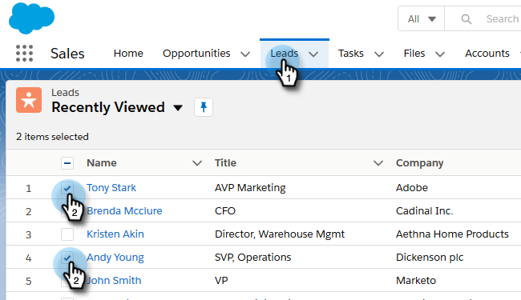

# 在[!DNL Salesforce Lightning]中使用大量動作 {#using-bulk-actions-in-salesforce-lightning}

瞭解如何執行大量動作，例如將銷售機會新增至行銷活動、傳送大量電子郵件，或將銷售機會從[!DNL Salesforce]推播至[!DNL Sales Connect]。

>[!PREREQUISITES]
>
>更新至[!DNL Sales Connect]封裝的最新版本，並在您的銷售機會/聯絡人檢視中安裝大量動作按鈕。
>
>* [英文指示](assets/sf-guide-for-lightning-en.pdf)
>* [日文指示](assets/sf-guide-for-lightning-ja.pdf)

>[!NOTE]
>
>在執行以下步驟之前，請確定您已登入您的[!DNL Marketo Sales Connect]帳戶。

## 大量電子郵件 {#bulk-email}

1. 在[!DNL Salesforce]中，按一下&#x200B;**[!UICONTROL Leads]**&#x200B;標籤，然後選擇想要的銷售機會清單。

   

   >[!NOTE]
   >
   >如果您已經位於要使用的清單中，您必須從下拉式清單中選擇它，以確保MSC大量動作按鈕顯示，以再次執行它。 這是無法變更的[!DNL Salesforce]行為。

1. 按一下箭號下拉式清單（在畫面最右邊）並選取&#x200B;**[!UICONTROL Email with MSC]**。

   

1. 將會出現MSC電子郵件。 它包含下列功能：

   a. 「[!UICONTROL To]」欄位顯示「所有回條」 — 這對應於您在「潛在客戶清單檢視表」中選擇的潛在客戶清單
b.此清單會顯示在名為「大量撰寫」的左側面板上 — 您可以在此處新增/移除收件者
c.您可以選擇範本或建立您自己的電子郵件
d.您可以立即傳送電子郵件，或排程在稍後傳送

   

## 新增至行銷活動 {#add-to-campaign}

1. 在[!DNL Salesforce]中，按一下&#x200B;**[!UICONTROL Leads]**&#x200B;標籤，然後選擇想要的銷售機會清單。

   

1. 按一下箭號下拉式清單（在畫面最右邊）並選取&#x200B;**[!UICONTROL Add to MSC Campaign]**。

   

1. 「[!UICONTROL Add People to Your Campaign]」快顯視窗將會出現。 按一下&#x200B;**[!UICONTROL Next]**&#x200B;並透過一般促銷活動流程來觸發MSC促銷活動。

   

## 推送到[!DNL Marketo Sales Connect] {#push-to-marketo-sales-connect}

1. 在[!DNL Salesforce]中，按一下&#x200B;**[!UICONTROL Leads]**&#x200B;標籤，然後選擇想要的銷售機會清單。

   

1. 按一下箭號下拉式清單（在畫面最右邊）並選取&#x200B;**[!UICONTROL Push to MSC]**。

   

1. 名為「[!DNL Salesforce] Bridge」的新標籤將會開啟。 按一下&#x200B;**[!UICONTROL Proceed to Group]→**&#x200B;按鈕。

   

1. 系統會將您傳送至您的MSC帳戶，您會在其中看到以日期/時間戳記建立的群組。 同步完成後，您將會收到通知，群組將會包含從[!DNL Salesforce]同步的潛在客戶。

   

>[!NOTE]
>
>您也可以依照相同的步驟，在「連絡人清單檢視」中使用大量動作。

>[!MORELIKETHIS]
>
>* [透過群組電子郵件傳送電子郵件](/help/marketo/product-docs/marketo-sales-connect/email/using-the-compose-window/sending-emails-via-group-email.md)
>* [使用Select和Send撰寫大量電子郵件](/help/marketo/product-docs/marketo-sales-connect/email/using-the-compose-window/composing-bulk-emails-with-select-and-send.md#sending-emails)
