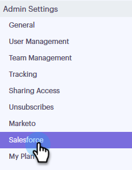

# 從Sales Connect帳戶{#disconnect-salesforce-from-your-sales-connect-account}斷開Salesforce

有時，您可能需要將Salesforce帳戶與Sales Connect帳戶斷開連接。 這是方法。

## 如何以管理員身分從Salesforce中斷連線{#how-to-disconnect-from-salesforce-as-an-admin}

1. 在Sales Connect中，按一下右上角的齒輪表徵圖，然後選擇&#x200B;**Settings**。

   

1. 在「管理設定」下，按一下「**Salesforce**」。

   

1. 在「連接和定制」頁籤中，按一下&#x200B;**斷開**。

   

## 如何以非管理員身分與Salesforce斷開連接{#how-to-disconnect-from-salesforce-as-a-non-admin}

1. 在Sales Connect中，按一下右上角的齒輪表徵圖，然後選擇&#x200B;**Settings**。

   

1. 在「我的帳戶」下，選擇&#x200B;**Salesforce**。

   

1. 在「連接和定制」頁籤中，按一下&#x200B;**斷開**。

   
