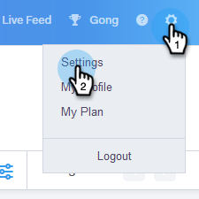
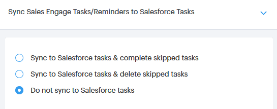

# Salesforce同步設定 {#salesforce-sync-settings}

## 透過API將電子郵件活動記錄到Salesforce {#logging-email-activity-to-salesforce-via-api}

若要使用此功能，您必須使用Enterprise/Unlimited版的Salesforce，或是Professional版（如果您已透過網站服務API購買整合）。

>[!PREREQUISITES]
>
>Salesforce和Sales Connect必須連線。

1. 在Sales Connect中，按一下右上方的齒輪圖示並選取 **設定**.

   

1. 在「我的帳戶（管理員設定，若您是管理員）」底下，按一下 **Salesforce**.

   

1. 按一下 **同步設定** 標籤。

   

1. 按一下「將電子郵件活動記錄到Salesforce」旁的箭頭。

   

1. 按一下 **Salesforce API** 標籤。 在此卡片中，您可以設定將資訊記錄到Salesforce的偏好設定。 按一下 **儲存** 完成時。

   

## 透過傳送電子郵件至Salesforce （密件副本），將電子郵件活動記錄到Salesforce {#logging-email-activity-to-salesforce-via-email-to-salesforce-bcc}

啟動「傳送電子郵件給Salesforce （密件副本）」後，您將會收到銷售電子郵件的密件副本，且您的電子郵件將記錄為商機、潛在客戶和聯絡人的活動。

>[!PREREQUISITES]
>
>Salesforce和Sales Connect必須連線。

**若要透過電子郵件（密件副本）在Salesforce中記錄電子郵件**

1. 在Sales Connect中，按一下右上方的齒輪圖示並選取 **設定**.

   

1. 在「我的帳戶（管理員設定，若您是管理員）」底下，按一下 **Salesforce**.

   

1. 按一下 **同步設定** 標籤。

   

1. 按一下 **電子郵件至Salesforce （密件副本）** 標籤並按一下 **啟動**.

   

如果由於某些原因，您的Salesforce電子郵件地址沒有拉入，請按照以下步驟在您的Salesforce帳戶中啟動密件副本功能：

1. 登入您的Salesforce執行個體。
1. 在右上角找到您的使用者名稱，然後選取下拉式清單。
1. 選取 **我的設定**.
1. 選取 **電子郵件**.
1. 選取 **我的電子郵件至Salesforce**.
1. 在此頁面中，您會看到標示為「傳送電子郵件至Salesforce位址」的欄位。 如果旁邊未填入任何內容，請向下捲動至「我的可接受電子郵件地址」。
1. 輸入您要密件副本的電子郵件地址。
1. 按一下 **儲存變更**.

**在「我的設定」中找不到我的電子郵件給Salesforce**

如果您在「設定」底下沒有看到「我的電子郵件給Salesforce」，可能是因為您的管理員沒有啟用它。 如果您的團隊不熟悉Salesforce，或您的團隊從未使用Salesforce提供的密件副本地址，就可能發生這種情況。

>[!NOTE]
>
>您需要管理員許可權才能設定此專案。

1. 按一下 **設定**.
1. 按一下 **電子郵件管理**.
1. 按一下 **傳送電子郵件至Salesforce**.
1. 按一下 **編輯**.
1. 勾選「使用中」旁的方塊。
1. 按一下 **儲存**.

## 將Sales Connect工作/提醒同步至Salesforce工作 {#sync-sales-connect-tasks-reminders-to-salesforce-tasks}

1. 按一下右上角的齒輪圖示並選取 **設定**.

   

1. 在「我的帳戶（管理員設定，若您是管理員）」底下，按一下 **Salesforce**.

   

1. 按一下 **同步設定** 標籤。

   

1. 按一下「將Sales Connect工作/提醒同步到Salesforce工作」旁的箭頭。

   

1. 選擇所要的選項（預設會選取「不要同步至Salesforce工作」）。

   
