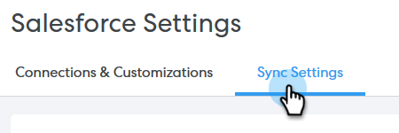

# Salesforce同步設定 {#salesforce-sync-settings}

## 透過API將電子郵件活動記錄至Salesforce {#logging-email-activity-to-salesforce-via-api}

若您已透過網站服務API購買整合，則需要使用Salesforce的企業版/不限數量版，或專業版。

>[!PREREQUISITES]
>
>必須連接Salesforce和Sales Connect。

1. 在Sales Connect中，按一下右上角的齒輪表徵圖並選擇 **設定**.

   

1. 在「我的帳戶」（如果您是管理員，則為「管理設定」）下，按一下 **Salesforce**.

   

1. 按一下 **同步設定** 標籤。

   

1. 按一下「將電子郵件活動記錄到Salesforce」旁的箭頭。

   

1. 按一下 **Salesforce API** 標籤。 在此卡中，您可以設定您對於將資訊記錄到Salesforce的首選項。 按一下 **儲存** 時才能使用。

   

## 透過電子郵件將電子郵件活動記錄到Salesforce(BCC) {#logging-email-activity-to-salesforce-via-email-to-salesforce-bcc}

激活「Email to Salesforce(BCC)」後，您將收到銷售電子郵件的BCC，並且您的電子郵件將作為有關機會、銷售機會和聯繫人的活動進行記錄。

>[!PREREQUISITES]
>
>必須連接Salesforce和Sales Connect。

**若要透過電子郵件(BCC)在Salesforce中記錄您的電子郵件**

1. 在Sales Connect中，按一下右上角的齒輪表徵圖並選擇 **設定**.

   

1. 在「我的帳戶」（如果您是管理員，則為「管理設定」）下，按一下 **Salesforce**.

   

1. 按一下 **同步設定** 標籤。

   

1. 按一下 **發送電子郵件至Salesforce(BCC)** 按一下 **啟動**.

   

如果由於某些原因，您的致Salesforce的電子郵件地址未被提取，請按照下列步驟在您的Salesforce帳戶中啟用BCC功能：

1. 登入您的Salesforce例項。
1. 在右上角找到您的使用者名稱，然後選取下拉式清單列。
1. 選擇 **我的設定**.
1. 選擇 **電子郵件**.
1. 選擇 **我給Salesforce的電子郵件**.
1. 在此頁面上，您會看到標示為「Email to Salesforce Address」的欄位。 如果旁邊未填入任何項目，請向下捲動至「我可接受的電子郵件地址」。
1. 輸入要BCC的電子郵件地址。
1. 按一下 **儲存變更**.

**在我的設定中找不到我給Salesforce的電子郵件**

如果您的「設定」下沒有看到「我給Salesforce的電子郵件」，則您的管理員可能尚未啟用它。 如果您的團隊是Salesforce的新手，或您的團隊從未使用Salesforce提供的BCC地址，就會發生此情況。

>[!NOTE]
>
>您需要管理員權限才能設定此設定。

1. 按一下 **設定**.
1. 按一下 **電子郵件管理**.
1. 按一下 **發送電子郵件給Salesforce**.
1. 按一下 **編輯**.
1. 勾選「作用中」旁的方塊。
1. 按一下 **儲存**.

## 將銷售連接任務/提醒同步到Salesforce任務 {#sync-sales-connect-tasks-reminders-to-salesforce-tasks}

1. 按一下右上角的齒輪圖示並選取 **設定**.

   

1. 在「我的帳戶」（如果您是管理員，則為「管理設定」）下，按一下 **Salesforce**.

   

1. 按一下 **同步設定** 標籤。

   

1. 按一下「將Sales Connect任務/提醒同步到Salesforce任務」旁邊的箭頭。

   

1. 選擇所需的選項（預設會選取「不同步至Salesforce任務」）。

   
