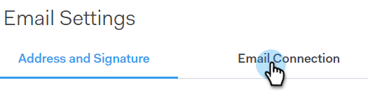
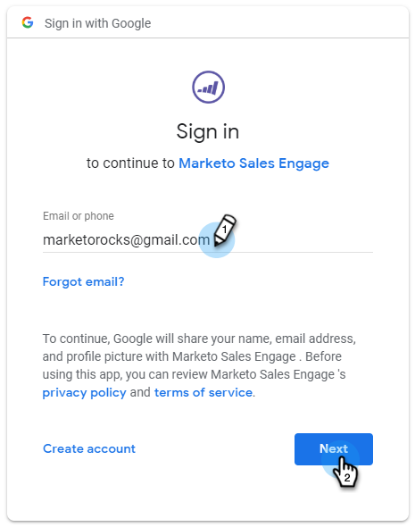
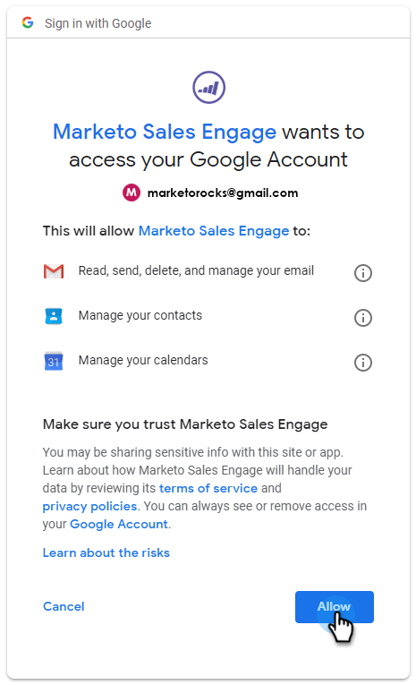

# Gmail 使用者的電子郵件連線 {#email-connection-for-gmail-users}

連線至Gmail表示您將會收到回覆追蹤、存取Gmail傳遞頻道、在Gmail中排程電子郵件以及傳送合規性。

>[!CAUTION]
>
>如果您[在Gmail帳戶中使用篩選器](https://support.google.com/mail/answer/6579?hl=en#zippy=%2Ccreate-a-filter%2Cedit-or-delete-filters){target="_blank"}或規則來自動將電子郵件標示為已讀取，這可能會導致回覆追蹤發生問題。 建議您停用搭配Gmail使用回覆追蹤時，將電子郵件自動標示為已讀取的任何規則。

1. 在[!DNL Sales Connect]中，按一下齒輪圖示並選取&#x200B;**[!UICONTROL Settings]**。

   

1. 在「我的帳戶」底下，選取&#x200B;**[!UICONTROL Email Settings]**。

   

1. 按一下「**[!UICONTROL Email Connection]**」索引標籤。

   

1. 按一下「**[!UICONTROL Get Started]**」。

   

1. 選取「**[!UICONTROL I use Gmail to send emails]**」然後按一下「**[!UICONTROL Next]**」。

   

1. 按一下「**[!UICONTROL OK]**」。

   

1. 如果您已登入Gmail，請選擇您要連線的帳戶。 如果沒有，請輸入您的Gmail位址，然後按一下&#x200B;**[!UICONTROL Next]**。 在此範例中，我們尚未登入。

   

1. 輸入您的密碼並按一下&#x200B;**[!UICONTROL Next]**。

   

1. 按一下「**[!UICONTROL Allow]**」。

   

   您可以使用此連線來追蹤電子郵件，並作為傳遞管道。

>[!NOTE]
>
>Gmail會強制實行自己的傳送限制。 [若要了解更多資訊，請參閱此處](/help/marketo/product-docs/marketo-sales-connect/email/email-delivery/email-connection-throttling.md#email-provider-limits)。
