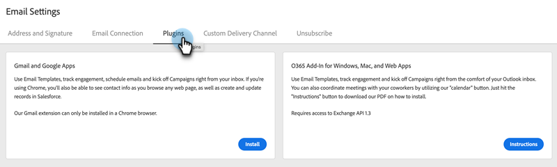

# 安裝 Gmail 適用的 Sales Connect 電子郵件外掛程式 {#install-the-sales-connect-email-plugin-for-gmail}

瞭解如何安裝Gmail外掛程式。

>[!IMPORTANT]
>
>Gmail和Outlook的電子郵件外掛程式僅支援Marketo Sales Connect使用者。 銷售人員Insight動作使用者&#x200B;**不支援**。

1. 在[網頁應用程式](https://toutapp.com/next#settings)中，按一下齒輪圖示並按一下&#x200B;**[!UICONTROL Settings]**。

   

1. 在「我的帳戶」底下，按一下&#x200B;**[!UICONTROL Email Settings]**。

   

1. 按一下「**[!UICONTROL Plugins]**」索引標籤。

   

1. 在Gmail和Google Apps底下，按一下&#x200B;**[!UICONTROL Install]**。

   
