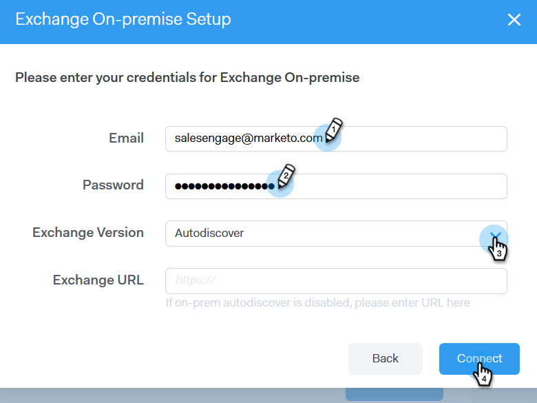

# Outlook使用者的電子郵件連線 {#email-connection-for-outlook-users}

瞭解如何將Sales Connect帳戶與Outlook連線。

>[!NOTE]
>
>每個使用者都必須從其Sales Connect帳戶連線至Outlook。

## 正在連線到Outlook Online {#connecting-to-outlook-online}

連線到Outlook表示您將會收到回覆追蹤、存取Outlook傳遞通道、在Outlook中排程電子郵件以及傳送規範的能力。

1. 在Sales Connect中，按一下齒輪圖示並選取 **設定**.

   

1. 在我的帳戶下，選取 **電子郵件設定**.

   

1. 按一下 **電子郵件連線** 標籤。

   

1. 按一下 **開始使用**.

   

1. 選取 **我使用Outlook傳送電子郵件** 並按一下 **下一個**.

   

1. 選取您正在使用的Outlook版本，然後按一下 **下一個**. 在此範例中，我們選擇Outlook Online。

   

   <table> 
    <tbody>
     <tr>
      <td><strong>Outlook Online</strong></td> 
      <td>也稱為Exchange Online</td> 
     </tr>
     <tr>
      <td><strong>Exchange On-premise</strong></td> 
      <td>包括Exchange 2013和2016</td> 
     </tr>
    </tbody>
   </table>

   >[!NOTE]
   >
   >Marketo目前不支援Exchange混合式帳戶。

1. 按一下 **確定**.

   

1. 如果您尚未登入Outlook，請輸入您的登入資訊，然後按一下 **下一個**. 如果您是，請選擇您要連線的帳戶，然後按一下 **下一個**. 在此範例中，我們已登入。

   

1. 按一下 **Accept**.

   

   您可以使用此連線來追蹤電子郵件，並作為傳遞管道。

   >[!NOTE]
   >
   >Outlook Online (Office365)會強制執行其本身的傳送限制。 [在此處瞭解更多](/help/marketo/product-docs/marketo-sales-connect/email/email-delivery/email-connection-throttling.md#email-provider-limits).

## 正在連線到Exchange On-Premise {#connecting-to-exchange-on-premise}

連線到Exchange內部部署表示您將會收到回覆追蹤、存取Outlook傳遞管道、在Outlook中排程電子郵件以及傳送合規性。

1. 在Sales Connect中，按一下齒輪圖示並選取 **設定**.

   

1. 在我的帳戶下，選取 **電子郵件設定**.

   

1. 按一下 **電子郵件連線** 標籤。

   

1. 按一下 **開始使用**.

   

1. 選取 **我使用Outlook傳送電子郵件** 並按一下 **下一個**.

   

1. 選取您正在使用的Outlook版本，然後按一下 **下一個**. 在此範例中，我們選擇Exchange On-premise。

   

   <table> 
    <tbody>
     <tr>
      <td><strong>Outlook Online</strong></td> 
      <td>也稱為Exchange Online</td> 
     </tr>
     <tr>
      <td><strong>Exchange On-premise</strong></td> 
      <td>包括Exchange 2013和2016</td> 
     </tr>
    </tbody>
   </table>

1. 輸入您的認證，然後按一下 **連線**.

   

   >[!NOTE]
   >
   >如果您在Exchange Version下拉式清單中關閉Autodiscover，您必須向IT部門詢問Exchange URL。

   您可以使用此連線來追蹤電子郵件，並作為傳遞管道。

   >[!NOTE]
   >
   >使用Exchange內部部署時，您的IT團隊將建立您的電子郵件傳送限制。
