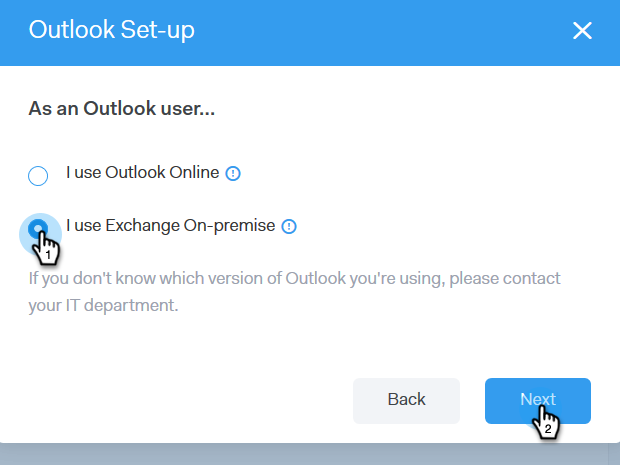

# Outlook用戶的電子郵件連接{#email-connection-for-outlook-users}

瞭解如何將您的Sales Connect帳戶與Outlook連接。

>[!NOTE]
>
>每位使用者都需要從其Sales Connect帳戶連線至Outlook。

## 連接到Outlook聯機{#connecting-to-outlook-online}

連線至Outlook表示您將會收到回覆追蹤、存取Outlook傳送通道、在Outlook中排程電子郵件並傳送符合規定的訊息。

1. 在Sales Connect中，按一下齒輪表徵圖並選擇&#x200B;**Settings**。

   

1. 在「My Account（我的帳戶）」下，選擇「Email Settings（電子郵件設定）」**。**

   

1. 按一下&#x200B;**電子郵件連接**&#x200B;頁籤。

   

1. 按一下&#x200B;**開始**。

   

1. 選擇&#x200B;**I use Outlook to send emails**，然後按一下&#x200B;**Next**。

   

1. 選擇您使用的Outlook版本，然後按一下&#x200B;**Next**。 在此示例中，我們選擇了Outlook Online。

   

   | **Outlook Online** | 也稱為Office Online |
   |---|---|
   | **Exchange現場** | 包括Exchange 2013和2016 |

1. 按一下&#x200B;**確定**。

   

1. 如果您未登錄Outlook，請輸入您的登錄資訊，然後按一下&#x200B;**Next**。 如果您是，請選擇您要連線的帳戶，然後按一下「下一步」。 ****&#x200B;在此範例中，我們已登入。

   

1. 按一下&#x200B;**接受**。

   

   您可以使用此連線來追蹤電子郵件，也可以當成傳送管道。

   >[!NOTE]
   >
   >使用Outlook做為傳送管道時，一次無法傳送超過300封大量電子郵件。

## 連接到Exchange內部部署{#connecting-to-exchange-on-premise}

連接到Exchange現場意味著您將收到回覆跟蹤、訪問Outlook交付渠道、在Outlook中安排電子郵件併發送法規遵從性。

1. 在Sales Connect中，按一下齒輪表徵圖並選擇&#x200B;**Settings**。

   

1. 在「My Account（我的帳戶）」下，選擇「Email Settings（電子郵件設定）」**。**

   

1. 按一下&#x200B;**電子郵件連接**&#x200B;頁籤。

   

1. 按一下&#x200B;**開始**。

   

1. 選擇&#x200B;**I use Outlook to send emails**，然後按一下&#x200B;**Next**。

   

1. 選擇您使用的Outlook版本，然後按一下&#x200B;**Next**。 在此示例中，我們選擇了Exchange內部部署。

   

   | 版本 | 說明 |
   |---|---|
   | **Outlook Online** | 也稱為Office Online |
   | **Exchange現場** | 包括Exchange 2013和2016 |

1. 輸入您的憑據，然後按一下&#x200B;**Connect**。

   

   >[!NOTE]
   >
   >如果您在「Exchange版本」下拉式清單中關閉Autodiscover，您將需要向IT部門詢問Exchange URL。

   您可以使用此連線來追蹤電子郵件，也可以當成傳送管道。

   >[!NOTE]
   >
   >使用Outlook做為傳送管道時，一次無法傳送超過300封大量電子郵件。
