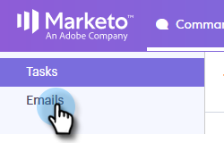

# 進階搜尋概觀 {#advanced-search-overview}

透過使用進階搜尋來鎖定已檢視、點選或回覆電子郵件的潛在客戶，您可以建立最常參與潛在客戶的目標清單。

## 如何存取進階搜尋 {#how-to-access-advanced-search}

1. 按一下 **指揮中心**.

   

1. 按一下 **電子郵件**.

   

1. 選擇適用的標籤。

   

1. 按一下 **進階搜尋**.

   

## 篩選器 {#filters}

**日期**

選擇搜尋的日期範圍。 預設日期會根據您選擇的電子郵件狀態（已傳送、未傳遞、擱置中）而更新。

**人員**

在「誰」區段中依電子郵件收件者/寄件者篩選。

| 下拉式清單 | 說明 |
|---|---|
| **檢視方式** | 在您的Sales Connect執行個體中依特定寄件者篩選（此選項僅供管理員使用）。 |
| **依群組** | 依特定收件者群組篩選電子郵件。 |
| **依人員** | 依特定收件者篩選。 |

**時間**

依建立日期、傳送日期、失敗日期或排程日期選擇。 可用選項會依據您選擇的電子郵件狀態（「已傳送」、「未傳遞」、「擱置中」）而變更。

**行銷活動**

依行銷活動參與率篩選電子郵件。

**狀態**

有三個電子郵件狀態可供選擇。 型別/活動選項會根據選取的狀態而變更。

***狀態：已傳送***

依您傳送的電子郵件活動篩選。 您可以選擇檢視/沒有檢視、點按/沒有點按，和/或回覆/沒有回覆。

***狀態：擱置中***

依所有待處理電子郵件篩選。

| 狀態 | 說明 |
|---|---|
| **已排程** | 已從撰寫視窗（Salesforce或Web應用程式）、電子郵件外掛程式或促銷活動排程的電子郵件。 |
| **草稿** | 目前處於草稿狀態的電子郵件。 電子郵件需要主旨行和收件者才能另存為草稿。 |
| **進行中** | 正在傳送的電子郵件。 電子郵件不應維持此狀態超過數秒鐘。 |

***狀態：未傳遞***

根據從未傳遞的電子郵件進行篩選。

| 狀態 | 說明 |
|---|---|
| **失敗** | 當電子郵件無法從Sales Connect傳送時（常見原因包括：電子郵件會傳送給已取消訂閱/封鎖的連絡人，或是在填入動態欄位時發生問題）。 |
| **已退回** | 收件者的伺服器拒絕電子郵件時，該電子郵件會標示為已退回。 此處只會顯示透過Sales Connect伺服器傳送的電子郵件。 |
| **垃圾訊息** | 收件者將電子郵件標示為垃圾訊息時（未經請求的電子郵件的常見詞語）。 此處只會顯示透過Sales Connect伺服器傳送的電子郵件。 |

## 已儲存的搜尋 {#saved-searches}

以下說明如何建立已儲存的搜尋。

1. 設定好所有篩選器後，按一下 **篩選器另存新檔**.

   

1. 提供搜尋名稱，然後按一下 **儲存**.

   

   您已儲存的搜尋會顯示在左側的側邊欄中。

   
