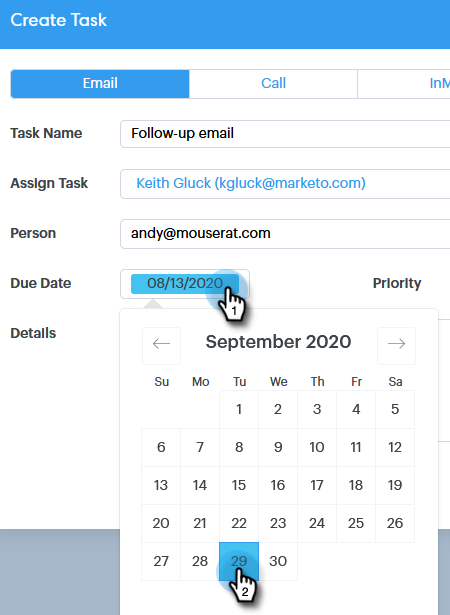

# 指派工作予團隊成員 {#assigning-tasks-to-team-members}

如果您想要與其他團隊成員合作，指派任務可能是協調您的潛在客戶工作的好方法。

>[!NOTE]
>
>您只能指派共用連絡人的工作。

1. 按一下&#x200B;**[!UICONTROL Command Center]**。

   

1. 按一下「**[!UICONTROL Add Task]**」。

   

1. 選取工作型別。

   

1. 為您的工作命名。

   

1. 在&#x200B;**[!UICONTROL Assign Task]**&#x200B;欄位中，選取您團隊中要指派任務的人。

   

1. 在「人員」欄位中新增您要聯絡的人員。

   

1. 選取 **[!UICONTROL Due Date]**。

   

1. 設定&#x200B;**[!UICONTROL Priority]**。

   

1. 新增與您的隊友相關的任何重要詳細資料（選擇性），然後按一下&#x200B;**[!UICONTROL Create]**。

   
