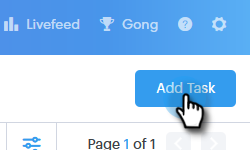

# 將任務分配給小組成員{#assigning-tasks-to-team-members}

如果希望與其他團隊成員協作，分配任務是協調潛在客戶開發工作的絕佳方法。

>[!NOTE]
>
>您只能為共用聯繫人指派任務。 在協作共用任務之前，您將希望[與團隊成員共用一組聯繫人](/help/marketo/product-docs/marketo-sales-connect/people/managing-contacts/how-to-share-a-group.md)。

1. 按一下&#x200B;**命令中心**。

   

1. 按一下&#x200B;**添加任務**。

   

1. 選擇任務類型。

   

1. 為您的任務命名。

   

1. 在「分配任務」(Assign Task)欄位中，選擇要分配任務的團隊中的人員。

   

1. 在「人員」欄位中新增您要與之聯繫的人員。

   

1. 選擇到期日。

   

1. 設定優先順序。

   

1. 新增與您的團隊成員相關的重要詳細資訊（可選），然後按一下「建立&#x200B;**」。**

   

>[!MORELIKETHIS]
>
>[如何共用群組](/help/marketo/product-docs/marketo-sales-connect/people/managing-contacts/how-to-share-a-group.md)
