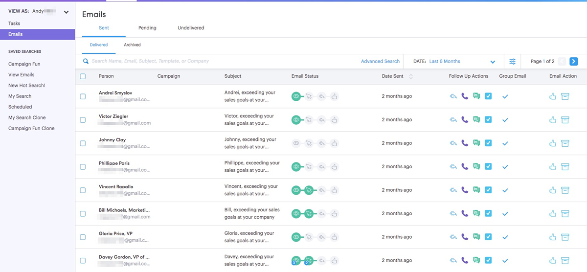

# 命令中心概述 {#command-center-overview}

Commend Center是單一、統一的檢視畫面，可協助您找出下一步驟，同時確保不會有任何東西漏掉。

## 管理電子郵件 {#manage-emails}

指揮中心的電子郵件區段是您管理所有電子郵件活動的位置。 您可以將其視為您的電子郵件寄件匣，以檢閱從Sales Connect傳送的電子郵件。 管理您的排程電子郵件、檢視誰一直在處理您的電子郵件、檢視您的電子郵件是否傳送有任何問題等。

電子郵件區段提供您對所有電子郵件的鳥瞰檢視，並透過主要標籤和子標籤簡化其組織，作為資料夾，您的電子郵件會根據其狀態自動儲存。

<table> 
 <colgroup> 
  <col> 
  <col> 
  <col> 
 </colgroup> 
 <tbody> 
  <tr> 
   <td title="背景顏色：灰色">
<strong>主要 </strong>
</td> 
   <td title="背景顏色：灰色">
<strong>次要 </strong>
</td> 
   <td title="背景顏色：灰色">
<strong>說明 </strong>
</td> 
  </tr> 
  <tr> 
   <td title="背景顏色：藍色"><strong title="">已傳送</strong></td> 
   <td title="背景顏色：藍色">已傳遞</td> 
   <td title="背景顏色：藍色">已傳遞給收件者的電子郵件。</td> 
  </tr> 
  <tr> 
   <td title="背景顏色：藍色"> </td> 
   <td title="背景顏色：藍色">已封存</td> 
   <td title="背景顏色：藍色">使用者為了停用電子郵件追蹤而封存的電子郵件。</td> 
  </tr> 
  <tr> 
   <td title="背景顏色：灰色"><strong title="">待處理</strong></td> 
   <td title="背景顏色：灰色">已排程</td> 
   <td title="背景顏色：灰色">目前排程要發出的電子郵件。 電子郵件一經傳送，就會移至傳送的資料夾。</td> 
  </tr> 
  <tr> 
   <td title="背景顏色：灰色"> </td> 
   <td title="背景顏色：灰色">草稿</td> 
   <td title="背景顏色：灰色">
已儲存為草稿的電子郵件。 <strong>注意：</strong> 只有單一電子郵件可以儲存為草稿。 大量電子郵件（選取和傳送電子郵件及群組電子郵件）將不會儲存為草稿。
</td> 
  </tr> 
  <tr> 
   <td title="背景顏色：灰色"> </td> 
   <td title="背景顏色：灰色">進行中</td> 
   <td title="背景顏色：灰色">這是電子郵件處於傳送動作時進入的中間狀態。 電子郵件應該只有幾分鐘在進行中。</td> 
  </tr> 
  <tr> 
   <td title="背景顏色：藍色"><strong title="">未傳遞</strong></td> 
   <td title="背景顏色：藍色">失敗</td> 
   <td title="背景顏色：藍色">傳送失敗的電子郵件。</td> 
  </tr> 
  <tr> 
   <td title="背景顏色：藍色"> </td> 
   <td title="背景顏色：藍色">已退回</td> 
   <td title="背景顏色：藍色">
收件者電子郵件伺服器拒絕的電子郵件。  <strong>注意：</strong> 只有當您是舊版ToutApp使用者並有權存取MSC伺服器作為傳遞通道時，才會偵測到這種情況。
</td> 
  </tr> 
  <tr> 
   <td title="背景顏色：藍色"> </td> 
   <td title="背景顏色：藍色">垃圾訊息</td> 
   <td title="背景顏色：藍色">
收件者手動標籤為垃圾郵件的電子郵件。 <strong>注意：</strong> 只有當您是舊版ToutApp使用者並有權存取MSC伺服器作為傳遞通道時，才會偵測到這種情況。
</td> 
  </tr> 
 </tbody> 
</table>

## 管理任務 {#manage-tasks}

作業區段是您管理和完成作業的一站式中心。 您可以在這裡順暢地管理您的工作，以提高生產力並專注於最相關的專案。

## 參與潛在客戶的後續追蹤 {#follow-up-with-engaged-prospects}

一旦您開始透過撰寫視窗或行銷活動與潛在客戶互動，您就可以開始利用進階搜尋功能，重新鎖定參與度最高的潛在客戶。

例如，如果您在MSC中新增100個人員至行銷活動，您可能想要重新鎖定檢視和按一下您的電子郵件，但未回覆的人員。 若要這麼做，您可以搭配使用行銷活動篩選器以及檢視和點按狀態活動篩選器，以識別要重新定位的人員清單。

額外優點：如果您儲存進階搜尋，則會在收件者檢視或按一下您的電子郵件後，儲存為動態清單並新增符合參與條件的電子郵件。

>[!MORELIKETHIS]
>
>* [任務](/help/marketo/product-docs/marketo-sales-connect/tasks/syncing-sales-connect-tasks-with-salesforce-for-the-first-time.md)
>* [進階搜尋概觀](/help/marketo/product-docs/marketo-sales-connect/email/command-center/advanced-search-overview.md)
>* [使用「選取並傳送」來撰寫大量電子郵件](/help/marketo/product-docs/marketo-sales-connect/email/using-the-compose-window/composing-bulk-emails-with-select-and-send.md)
