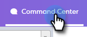

# 電子郵件欄和電子郵件頁面配置 {#email-columns-and-email-page-layout}

您可以設定任何可用的欄，使其顯示在命令中心的電子郵件區段中。 您的組態設定會針對每個電子郵件子資料夾進行儲存（例如，已傳送、失敗、已排程等）。

## 電子郵件欄 {#email-columns}

<table> 
 <colgroup> 
  <col> 
  <col> 
 </colgroup> 
 <tbody> 
  <tr> 
   <th>
欄
</th> 
   <th>說明</th> 
  </tr> 
  <tr> 
   <td>個人</td> 
   <td>Sales Connect中人員的姓名和電子郵件。 按一下此欄位將會在人員詳細資料檢視中開啟「關於」標籤。</td> 
  </tr> 
  <tr> 
   <td>名稱</td> 
   <td>Sales Connect中的人員名稱。</td> 
  </tr> 
  <tr> 
   <td>地址</td> 
   <td>Sales Connect中人員的主要電子郵件地址。</td> 
  </tr> 
  <tr> 
   <td>Campaign</td> 
   <td>如果電子郵件是作為促銷活動的一部分傳送，這會顯示促銷活動的名稱。 按一下此欄位會前往該行銷活動的設定頁面。</td> 
  </tr> 
  <tr> 
   <td>範本</td> 
   <td>顯示範本的名稱（如果電子郵件是隨附一個範本）。</td> 
  </tr> 
  <tr> 
   <td colspan="1">主旨</td> 
   <td colspan="1">電子郵件的主旨行。</td> 
  </tr> 
  <tr> 
   <td colspan="1">群組</td> 
   <td colspan="1">顯示電子郵件收件者所屬的群組。</td> 
  </tr> 
  <tr> 
   <td>職稱</td> 
   <td>電子郵件收件者的標題。</td> 
  </tr> 
  <tr> 
   <td>公司</td> 
   <td>電子郵件收件者的公司。</td> 
  </tr> 
  <tr> 
   <td>電子郵件狀態</td> 
   <td>電子郵件所處的狀態。 狀態包括：草稿、已排程、進行中、垃圾訊息、已退回、已失敗、已傳送。 已傳送電子郵件會顯示活動資料流，其中顯示在該電子郵件上發生的檢視、點按和回複數。</td> 
  </tr> 
  <tr> 
   <td>建立日期</td> 
   <td>建立電子郵件的日期。</td> 
  </tr> 
  <tr> 
   <td>上次更新時間</td> 
   <td>上次更新電子郵件的日期。</td> 
  </tr> 
  <tr> 
   <td>傳遞頻道</td> 
   <td>用於傳送電子郵件的傳遞通道名稱。</td> 
  </tr> 
  <tr> 
   <td>最新活動</td> 
   <td>電子郵件收件者的上次參與（例如，檢視、按一下或回覆）。</td> 
  </tr> 
  <tr> 
   <td>傳送日期</td> 
   <td>傳送電子郵件的日期。</td> 
  </tr> 
  <tr> 
   <td>後續動作</td> 
   <td>可透過電子郵件、電話、inMail或工作進行後續追蹤的快速動作按鈕。</td> 
  </tr> 
  <tr> 
   <td>群組電子郵件</td> 
   <td>如果電子郵件是以群組電子郵件的一部分傳送，則顯示核取標籤。</td> 
  </tr> 
  <tr> 
   <td>任務到期日</td> 
   <td>顯示與電子郵件相關之任務的到期日。 任務可以透過從電子郵件清單中的快速動作按鈕建立來與電子郵件相關。</td> 
  </tr> 
  <tr> 
   <td>電子郵件動作</td> 
   <td>可用於對電子郵件採取動作的快速動作按鈕。 根據電子郵件的狀態，可以使用以下動作：封存、成功、刪除、重試傳送、取消封存。</td> 
  </tr> 
  <tr> 
   <td>任務型別</td> 
   <td>顯示與電子郵件相關之任務的任務型別。 任務可以透過從電子郵件清單中的快速動作按鈕建立來與電子郵件相關。</td> 
  </tr> 
  <tr> 
   <td>日期失敗</td> 
   <td>顯示未傳遞電子郵件時電子郵件失敗的日期。</td> 
  </tr> 
 </tbody> 
</table>

## 電子郵件頁面配置設定 {#email-page-layout-settings}

您可以依照以下步驟設定版面。

1. 前往指揮中心。

   

1. 選取 **電子郵件** 區段。

   

1. 按一下設定按鈕。 您的選項包括：選擇您想要多少列、選取您要顯示的欄位，以及選取是否要將群組電子郵件彙總至網格中的單一專案（或是否要將屬於電子郵件網格一部分的所有電子郵件顯示為單一專案）。

   

1. 完成時，只要在設定外部按一下即可。
