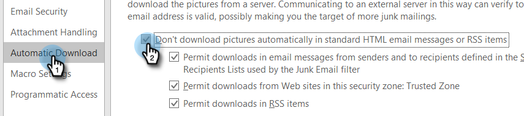

# 防止自檢{#preventing-self-views}

## 概述{#overview}

取得檢視追蹤的誤報可能會導致報告不一致。 當MSC的使用者不小心從電子郵件用戶端叫用追蹤像素（我們稱其為自我檢視）時，就常會發生這種情況。 以下是大幅降低甚至消除自我檢視的一些秘訣。

## Web(Outlook Web App and Gmail){#web-outlook-web-app-and-gmail}

Sales Connect會在您的瀏覽器中儲存Cookie，以防止在從Outlook網頁應用程式和Gmail開啟電子郵件時追蹤檢視。 如果您仍在收到自我檢視，建議您執行下列動作：

* 請確定您的電腦上已啟用Cookie。

* 如果您使用新的電腦或行動裝置，請確定您已登入Web應用程式。 這可讓我們識別您的電腦／裝置。

## 案頭(Windows){#desktop-windows}

檢視是透過在電子郵件用戶端中下載小型隱形影像像素來追蹤。 您可以停用要自動下載的影像，大幅降低Outlook中的自我檢視量。 以下是步驟。

1. 在Outlook中，按一下菜單欄中的&#x200B;**檔案**。

   

1. 按一下&#x200B;**選項**。

   

1. 在「Outlook選項」對話框中，按一下&#x200B;**信任中心**。

   

1. 在「Microsoft Outlook信任中心」下，按一下「**信任中心設定」**。

   

1. 按一下左側功能表中的「自動下載」，然後選取「不要在HTML電子郵件或RSS項目中自動下載圖片」核取方塊。****

   

1. 在「信任中心」(Trust Center)對話框中，按一下「確定」(OK)**。**

   

1. 在「Outlook選項」對話框中按一下「**確定**」。

   

## 案頭(Mac){#desktop-mac}

檢視是透過在電子郵件用戶端中下載小型隱形影像像素來追蹤。 您可以停用要自動下載的影像，大幅降低Outlook中的自我檢視量。 以下是步驟。

1. 在Outlook中，按一下菜單欄中的&#x200B;**Outlook** ，然後選擇&#x200B;**首選項**。

   

1. 在「電子郵件」下，選擇&#x200B;**Reading**。

   

1. 在「Security（安全性）」下，按一下「Never **（從不）」單選按鈕。**

   
