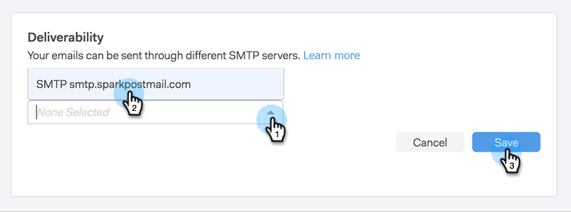

# 設定自訂傳遞通道 {#setting-up-a-custom-delivery-channel}

Marketo Sales Connect可讓您整合自訂SMTP伺服器，以傳送您的電子郵件。 如果您不想從Gmail或Exchange傳遞通道傳送大量電子郵件，這個選項很合適。

使用者可以設定自訂SMTP伺服器以供其個人使用，或者管理員可以設定Team SMTP供您執行個體中的所有Sales Connect使用者共用。

>[!NOTE]
>
>* 除了設定SMTP伺服器之外， [必須驗證電子郵件身分](/help/marketo/product-docs/marketo-sales-connect/getting-started/email-settings/verify-your-email.md) 傳送電子郵件之前。
>* 建議您與您的IT團隊或SMTP伺服器供應商合作，取得SMTP伺服器的正確伺服器認證。
>* 您無法使用SMTP伺服器認證來連線您的Gmail和Exchange伺服器。 請使用我們的電子郵件連線服務來整合這些提供者。

## 自訂SMTP {#custom-smtp}

1. 登入 [網頁應用程式](https://toutapp.com/login)，按一下右上方的齒輪圖示，然後選擇 **設定**.

   

1. 在我的帳戶下，按一下 **電子郵件設定**.

   

1. 按一下 **自訂傳遞管道**.

   

1. 輸入您的SMTP伺服器認證，然後按一下 **Connect**.

   

   >[!NOTE]
   >
   >如果這是您唯一的傳送頻道，則會自動指派給您所有的電子郵件身分識別，而您已經完成此操作。 如果這不是您唯一的傳遞管道，請繼續前往步驟5。

1. 仍然在「電子郵件設定」中時，按一下 **地址與簽名**.

   

1. 尋找您要選擇傳遞頻道的電子郵件身分識別，然後按一下 **選擇傳遞頻道**.

   

1. 在「傳遞能力卡」中，按一下 **編輯**.

   

1. 按一下「頻道」下拉式清單，然後選擇您剛才新增的自訂傳送頻道。 按一下 **儲存**.

   

   >[!NOTE]
   >
   >如果您的團隊管理員設定了Team SMTP Server，它只會自動套用至您的預設電子郵件身分識別，並且可作為您其他電子郵件身分識別的選項。

## Team SMTP伺服器 {#team-smtp-server}

>[!NOTE]
>
>**需要管理員許可權**

1. 登入 [網頁應用程式](https://toutapp.com/login)，按一下右上方的齒輪圖示，然後選擇 **設定**.

   

1. 在「管理設定」底下，按一下 **一般**.

   

1. 按一下 **團隊傳遞頻道**.

   

1. 輸入您的SMTP伺服器認證，然後按一下 **Connect**.

   

   >[!NOTE]
   >
   >Team SMTP Server將是所有團隊成員預設電子郵件身分的預設傳遞通道。 此外，它將成為所有其他電子郵件身分識別的傳送通道選項。

   >[!MORELIKETHIS]
   >
   >* [Gmail使用者的電子郵件連線](/help/marketo/product-docs/marketo-sales-connect/email-plugins/gmail/email-connection-for-gmail-users.md)
   >
   >* [Outlook使用者的電子郵件連線](/help/marketo/product-docs/marketo-sales-connect/email-plugins/msc-for-outlook/email-connection-for-outlook-users.md)
