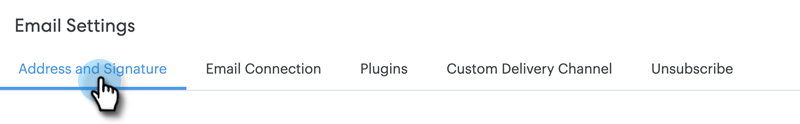

# 設定自訂傳送通道 {#setting-up-a-custom-delivery-channel}

Marketo Sales Connect允許您與自訂SMTP伺服器整合，以便傳送電子郵件。 對於那些不想從Gmail或Exchange交付管道傳送大量電子郵件的人，這是絕佳的選擇。

用戶可以設定自定義SMTP伺服器以供其個人使用，或者管理員可以設定一個Team SMTP以在您實例中的所有Sales Connect用戶之間共用。

>[!NOTE]
>
>* 除了設定SMTP伺服器外，您的 [必須驗證電子郵件身分](/help/marketo/product-docs/marketo-sales-connect/getting-started/email-settings/verify-your-email.md) 傳送電子郵件。
>* 建議您與IT團隊或SMTP伺服器供應商合作，為SMTP伺服器取得正確的伺服器憑證。
>* 您無法使用SMTP伺服器憑證連接Gmail和Exchange伺服器。 請使用我們的電子郵件連線服務來與這些提供者整合。

## 自訂SMTP {#custom-smtp}

1. 登入 [網頁應用程式](https://toutapp.com/login)，按一下右上角的齒輪圖示，然後選擇 **設定**.

   

1. 在「我的帳戶」下，按一下 **電子郵件設定**.

   

1. 按一下 **自訂傳送通道**.

   

1. 輸入您的SMTP伺服器憑據，然後按一下 **Connect**.

   

   >[!NOTE]
   >
   >如果這是您唯一的傳送管道，則會自動指派給所有電子郵件身分識別，您即可在此完成。 如果這不是您唯一的傳送通道，請繼續執行步驟5。

1. 在「電子郵件設定」中，按一下 **地址和簽名**.

   

1. 尋找您要選擇傳送通道的電子郵件身分識別，然後按一下 **選擇傳送通道**.

   

1. 在傳遞卡中，按一下 **編輯**.

   

1. 按一下「通道」下拉式清單，然後選擇您剛新增的自訂傳送通道。 按一下 **儲存**.

   

   >[!NOTE]
   >
   >如果您的團隊管理員設定了團隊SMTP伺服器，則該伺服器將自動僅應用於預設的電子郵件標識，並作為其他電子郵件標識的選項可用。

## 團隊SMTP伺服器 {#team-smtp-server}

>[!NOTE]
>
>**需要管理權限**

1. 登入 [網頁應用程式](https://toutapp.com/login)，按一下右上角的齒輪圖示，然後選擇 **設定**.

   

1. 在「管理設定」下，按一下 **一般**.

   

1. 按一下 **團隊傳送管道**.

   

1. 輸入您的SMTP伺服器憑據，然後按一下 **Connect**.

   

   >[!NOTE]
   >
   >團隊SMTP伺服器將是所有團隊成員預設電子郵件標識的預設傳送通道。 此外，它也可作為所有其他電子郵件身分識別的傳送通道選項。

   >[!MORELIKETHIS]
   >
   >* [Gmail使用者的電子郵件連線](/help/marketo/product-docs/marketo-sales-connect/email-plugins/gmail/email-connection-for-gmail-users.md)
   >
   >* [Outlook用戶的電子郵件連接](/help/marketo/product-docs/marketo-sales-connect/email-plugins/msc-for-outlook/email-connection-for-outlook-users.md)

