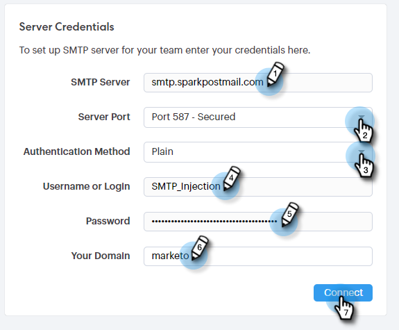

# 設定自訂傳送渠道{#setting-up-a-custom-delivery-channel}

Marketo Sales Connect允許您與自定義SMTP伺服器整合，以便發送電子郵件。 對於不想從Gmail或Exchange傳遞通道發送大量電子郵件的用戶來說，這是一個絕佳的選擇。

用戶可以設定自定義SMTP伺服器以供其個人使用，管理員也可以設定要在實例中所有Sales Connect用戶之間共用的Team SMTP。

>[!NOTE]
>
>* 除了設定SMTP伺服器外，您的[電子郵件標識還必須經過](/help/marketo/product-docs/marketo-sales-connect/getting-started/email-settings/verify-your-email.md)驗證，才能發送電子郵件。
>* 我們建議與IT團隊或SMTP伺服器供應商合作，為SMTP伺服器獲取正確的伺服器憑據。
>* 您無法使用SMTP伺服器憑據連接Gmail和Exchange伺服器。 請使用我們的Email Connection服務與這些供應商整合。

## 自定義SMTP {#custom-smtp}

1. 登入[Web應用程式](https://toutapp.com/login)，按一下右上方的齒輪圖示，然後選擇「設定」****。

   

1. 在「My Account（我的帳戶）」下，按一下「Email Settings（電子郵件設定）」**。**

   

1. 按一下「自訂傳送渠道」。****

   

1. 輸入SMTP伺服器憑據，然後按一下&#x200B;**Connect**。

   

   >[!NOTE]
   >
   >如果這是您唯一的傳送渠道，則會自動指派給您所有的電子郵件身分，您就可以了。 如果這不是您唯一的傳送渠道，請繼續步驟5。

1. 在「電子郵件設定」中，按一下「**地址與簽名」**。

   

1. 尋找您要選擇傳送渠道的電子郵件識別碼，然後按一下「選擇傳送渠道」。****

   

1. 在「傳遞性卡片」中，按一下「編輯&#x200B;**」。**

   

1. 按一下「渠道」下拉式清單，然後選擇您剛新增的自訂傳送渠道。 按一下&#x200B;**保存**。

   

   >[!NOTE]
   >
   >如果您的團隊管理員設定了團隊SMTP伺服器，它將自動僅應用於預設的電子郵件標識，並作為其他電子郵件標識的選項提供。

## 團隊SMTP伺服器{#team-smtp-server}

>[!NOTE]
>
>**需要管理員權限**

1. 登入[Web應用程式](https://toutapp.com/login)，按一下右上方的齒輪圖示，然後選擇「設定」****。

   

1. 在「管理設定」下，按一下「一般」****。

   

1. 按一下&#x200B;**團隊交付渠道**。

   

1. 輸入SMTP伺服器憑據，然後按一下&#x200B;**Connect**。

   

   >[!NOTE]
   >
   >團隊SMTP伺服器將是所有團隊成員預設電子郵件標識的預設傳送渠道。 此外，它也可作為所有其他電子郵件身分的傳送管道選項。

   >[!MORELIKETHIS]
   >
   >* [Gmail使用者的電子郵件連線](/help/marketo/product-docs/marketo-sales-connect/email-plugins/gmail/email-connection-for-gmail-users.md)
      >
      >
   * [Outlook用戶的電子郵件連接](/help/marketo/product-docs/marketo-sales-connect/email-plugins/msc-for-outlook/email-connection-for-outlook-users.md)

