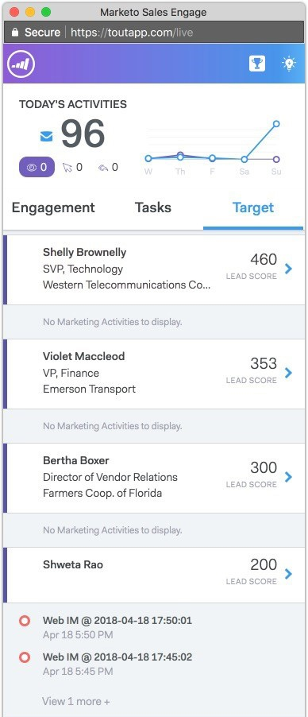

# 即時摘要概觀 {#live-feed-overview}

即時摘要是可從Web應用程式或Gmail外掛程式啟動的浮動視窗，可即時檢視潛在客戶參與情形。

## 參與標籤 {#engagement-tab}

即時檢視您MSE電子郵件的參與度（檢視、點按和回覆）。

標示為紫色的人員正在參與您的行銷內容。 MSE中可能不存在這些人員。 您可以按一下向下箭頭來新增這些動作，並取得其他快速動作的清單。

以藍線標示的人表示與透過MSE傳送之電子郵件的互動。

>[!NOTE]
>
>整體而言，我們會根據IP追蹤儘可能精確地判斷位置。 不幸的是，這並非精確的科學。 如果我們對您的收件者之一誤報了位置，以下提供幾個選項來說明可能發生的狀況：
>
>* 如果收件者登入的IT總部位於其他城市或國家/地區的公司無線網路，我們會記錄該位置，而非收件者目前的地區設定。
>* 如果您的電子郵件是轉寄或由「副本抄送/密件副本」欄位中的某人開啟，我們會嘗試準確顯示這些人的位置。

## 任務標籤 {#tasks-tab}

直接從即時摘要快速檢查您的待辦事項清單。

建立新任務或管理未完成任務。

篩選為今天、明天、今天 *和* 明天或未來7天。

>[!NOTE]
>
>您無法在「即時摘要」中使用自訂日期篩選器，但可以在Web應用程式中使用。

使用快速動作按鈕快速撥打電話、傳送電子郵件或導覽至個人的Linkedin設定檔。

## Target標籤 {#target-tab}

檢視您依潛在客戶評分排名的最上層人員（從最高到最低排序）。 系統會從您的Marketo執行個體提取銷售機會分數。

* 當其個人分數在Marketo中增加時，將產生潛在客戶。
* 我們顯示前50個銷售機會。
* 您只會在Salesforce中看到指派給您的人員。

## 圖示字彙表 {#icon-glossary}

<table> 
 <colgroup> 
  <col> 
  <col> 
 </colgroup> 
 <tbody> 
  <tr> 
   <td> 
    
 
     

 
    
</td> 
   <td>
有人檢視您的電子郵件
</td> 
  </tr> 
  <tr> 
   <td> 
    
 
     

 
    
</td> 
   <td>
有人按一下您的電子郵件中的連結
</td> 
  </tr> 
  <tr> 
   <td> 
    
 
     

 
    
</td> 
   <td>
有人回覆您的電子郵件
</td> 
  </tr> 
  <tr> 
   <td colspan="1"> 
    
 
     

 
    
</td> 
   <td colspan="1">在「有趣的時刻」下列出的任何通知，包括電子郵件、網頁和里程碑</td> 
  </tr> 
 </tbody> 
</table>

>[!NOTE]
>
>如果您看到有人在您的「即時摘要」中一遍又一遍地檢視您的電子郵件，他們可能會將電子郵件轉寄給其他收件者。 如果您注意到這些檢視的位置開始變更，就很可能發生這種情況。
