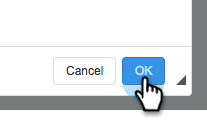

# 自訂取消訂閱連結訊息 {#customize-unsubscribe-link-message}

我們一律允許團隊自訂其取消訂閱的連結訊息，但現在管理員可以為整個團隊設定取消訂閱的連結訊息，以確保傳訊一致。

>[!NOTE]
>
>您不能使用具有Sales Connect的第三方取消訂閱連結，因為此資訊將不會被捕獲回我們的資料庫。

## 自訂訊息 {#customize-messaging-for-yourself}

1. 登入 [網頁應用程式](https://toutapp.com/login)，按一下右上角的齒輪圖示，然後選擇 **設定**.

   

1. 在「我的帳戶」下，選擇 **取消訂閱數**.

   

1. 在文字方塊中寫出您的自訂訊息。

   

1. 反白顯示您希望人們點按以取得取消訂閱頁面的文字，然後按一下連結圖示。

   

   >[!NOTE]
   >
   >超連結的URL是什麼並不重要。 傳送電子郵件時，超連結會轉換為我們的取消訂閱連結。

1. 按一下 **確定**.

   

## 為您的團隊設定取消訂閱消息 {#set-unsubscribe-messaging-for-your-team}

1. 登入 [網頁應用程式](https://toutapp.com/login)，按一下右上角的齒輪圖示，然後選擇 **設定**.

   

1. 在「管理設定」下，選取 **取消訂閱數**.

   

1. 自訂您的訊息，然後按一下 **儲存** 時才能使用。

   

1. 選擇 **我正在為我的團隊設定預設消息** 以便將消息應用於所有用戶。

   
