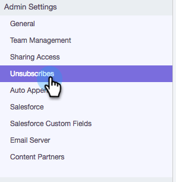

# 自定義取消訂閱連結消息{#customize-unsubscribe-link-message}

我們一向允許團隊自訂其取消訂閱連結訊息，但現在管理員可以為整個團隊設定取消訂閱連結訊息，以確保傳訊的一致性。

>[!NOTE]
>
>您不能將第三方取消訂閱連結與Sales Connect一起使用，因為此資訊不會被捕獲回我們的資料庫。

## 自定義消息傳遞{#customize-messaging-for-yourself}

1. 登入[Web應用程式](https://toutapp.com/login)，按一下右上方的齒輪圖示，然後選擇「設定」****。

   

1. 在「My Account（我的帳戶）」下，選擇&#x200B;**取消訂閱**。

   

1. 在文字方塊中寫出您的自訂訊息。

   

1. 反白標示您希望訪客點按的文字，以前往您的取消訂閱頁面，然後按一下連結圖示。

   

   >[!NOTE]
   >
   >超連結的URL是什麼並不重要。 當傳送電子郵件時，超連結將會轉換為我們的取消訂閱連結。

1. 按一下&#x200B;**確定**。

   

## 為您的團隊設定取消訂閱消息{#set-unsubscribe-messaging-for-your-team}

1. 登入[Web應用程式](https://toutapp.com/login)，按一下右上方的齒輪圖示，然後選擇「設定」****。

   

1. 在「管理設定」下，選擇&#x200B;**取消訂閱**。

   

1. 自訂您的訊息，然後在完成時按一下「儲存&#x200B;**」。**

   

1. 選擇&#x200B;**I am setting the default messaging for my team**&#x200B;以使消息傳遞應用於所有用戶。

   
