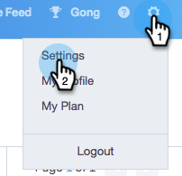

# 自訂取消訂閱連結訊息 {#customize-unsubscribe-link-message}

我們一向允許團隊自訂其取消訂閱連結訊息，但現在管理員可以為整個團隊設定取消訂閱連結訊息，以確保傳訊的一致性。

>[!NOTE]
>
>您不能將第三方取消訂閱連結與Sales Connect一起使用，因為此資訊不會被捕獲回我們的資料庫。

## 自訂訊息 {#customize-messaging-for-yourself}

1. 登入Web應用程 [式](http://toutapp.com/login)，按一下右上角的齒輪圖示，然後選擇「 **設定」**。

   

1. 在「我的帳戶」下，選擇「取 **消訂閱**」。

   

1. 在文字方塊中寫出您的自訂訊息。

   

1. 反白標示您希望訪客點按的文字，以前往您的取消訂閱頁面，然後按一下連結圖示。

   

   >[!NOTE]
   >
   >超連結的URL是什麼並不重要。 當傳送電子郵件時，超連結將會轉換為我們的取消訂閱連結。

1. 按一下 **確定**。

   

## 為您的團隊設定取消訂閱消息 {#set-unsubscribe-messaging-for-your-team}

1. 登入Web應用程 [式](http://toutapp.com/login)，按一下右上角的齒輪圖示，然後選擇「 **設定」**。

   

1. 在「管理員設定」下，選取「取 **消訂閱**」。

   

1. 自訂您的訊息，然後在完成時 **按一下** 「儲存」。

   

1. 選擇 **我正在為我的團隊設定預設消息** ，以使消息應用於所有用戶。

   

