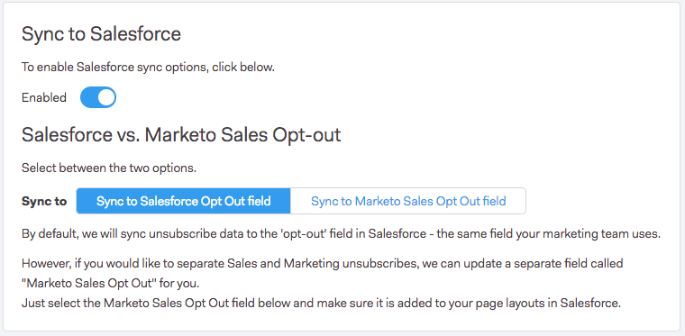

# 將取消訂閱與Salesforce同步 {#syncing-unsubscribes-with-salesforce}

## 取消訂閱以同步至Salesforce的需求 {#requirements-for-unsubscribes-to-sync-to-salesforce}

* 必須啟用「取消訂閱同步」（用於夜間同步）
* 必須在Salesforce中安裝「退出」欄位
* Sales Connect中的人員記錄必須具有Salesforce ID

**推送取消訂閱數**

在Sales Connect中收集到取消訂閱時，我們會即時將其推送至Salesforce，並更新您選取要同步的選擇退出欄位。 如果您已停用Salesforce同步，我們仍會推送取消訂閱至電子郵件選擇退出。

**取消訂閱同步**

啟用取消訂閱同步後（下面的步驟3），您將開啟夜間同步。 同步在晚上8:00 PST左右發生一次。 它會透過Salesforce中的「退出」欄位，雙向同步Marketo Sales中的所有取消訂閱。

## 將「取消訂閱同步」配置為Salesforce {#configure-unsubscribe-sync-to-salesforce}

使用者可以決定要將取消訂閱與Marketo也可以同步的標準電子郵件選擇退出欄位同步，還是可以與Marketo銷售選擇退出欄位同步，以便區別銷售取消訂閱和行銷取消訂閱。

1. 前往 [網頁應用程式](https://toutapp.com/login)，按一下齒輪圖示並選取 **設定**.

   

1. 在「管理設定」下，選取 **取消訂閱數**.

   

1. 按一下 **與Salesforce同步**，然後啟用夜間同步。

   

1. 選取您要同步至的欄位。

   

   | 欄位 | 說明 |
   |---|---|
   | **同步至Salesforce選擇退出欄位** | 預設情況下，僅更新「Salesforce選擇退出」欄位。 |
   | **同步至Marketo銷售選擇退出欄位** | 如果您想要區隔「銷售」和「行銷」取消訂閱，請選擇此選項以更新其他 [Marketo銷售選擇退出欄位。](#msoo) |

## 在頁面配置中安裝選擇退出欄位 {#installing-the-opt-out-field-in-the-page-layout}

**電子郵件選擇退出**

「Email Opt Out」是Salesforce中的標準欄位，可從Salesforce安裝。 您必須是Salesforce管理員才能安裝。

1. 前往 [Salesforce.com](https://salesforce.com) 並登入。

   

1. 按一下您的使用者名稱並選取 **設定**.

   

1. 在快速查找框中搜索聯繫人或銷售機會。 在此情況下，我們將欄位安裝到「聯繫人」頁面佈局，但您將要為兩個人員記錄安裝。

   

1. 選擇 **頁面配置**.

   

1. 選擇 **編輯** 欄位（位於您要新增欄位的頁面配置旁）。

   

1. 選擇 **欄位**.

   

1. 將「電子郵件選擇退出」拖放至頁面配置。

   

1. 按一下 **儲存**.

   

## Marketo銷售選擇退出 {#marketo-sales-opt-out}

「Marketo銷售選擇退出」欄位是自訂欄位，可供已安裝Marketo銷售連線自訂的使用者使用。

在您成功將Marketo Sales Connect自訂項目安裝到Salesforce後，您會看到可用的Marketo Sales Opt Out欄位。
