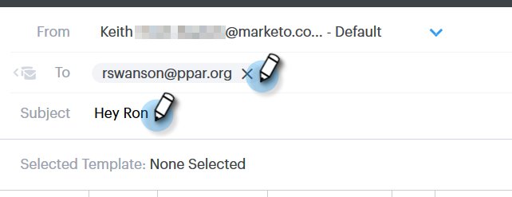
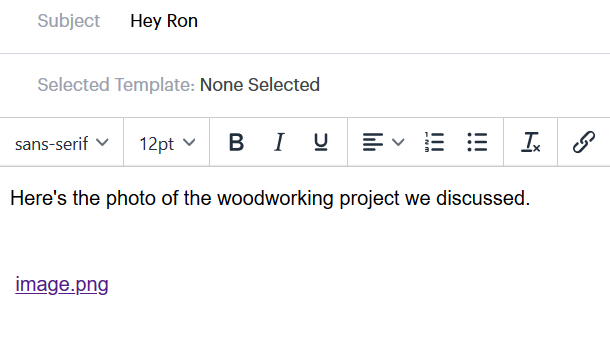

# 將附件或可追蹤內容新增至電子郵件 {#add-an-attachment-or-trackable-content-to-your-email}

通過Sales Connect發送電子郵件時，您可以選擇添加檔案作為附件，或將檔案設為可下載（和可跟蹤）的連結。

>[!NOTE]
>
>通常，超過20MB的任何檔案都太大，無法傳送。 您可以透過電子郵件傳送的附件大小，會依您使用的電子郵件傳送通道而有所不同。

## 新增附件 {#add-an-attachment}

1. 建立電子郵件草稿(有多種方法可執行此作業，在此範例中，我們選擇 **撰寫** 中)。

   

1. 填入「收件人」欄位並輸入主旨。

   

1. 按一下附件圖示。

   

1. 選取要附加的檔案，然後按一下 **插入**.

   

   >[!NOTE]
   >
   >如果您需要上傳檔案，請按一下 **上傳內容** 按鈕。

   

附件會顯示在您的電子郵件底部。

## 新增可追蹤內容 {#add-trackable-content}

1. 建立您的電子郵件草稿（有多種方法可執行此作業，在此範例中，我們選擇「撰寫」視窗）。

   

1. 填入「收件人」欄位並輸入主旨。

   

1. 按一下電子郵件中您希望可追蹤內容顯示的位置，然後按一下附件圖示。

   

1. 選取要新增的內容，按一下 **內容已追蹤** 滑桿，然後按一下 **插入**.

   

   >[!NOTE]
   >
   >如果您需要上傳檔案，請按一下 **上傳內容** 按鈕。

   內容會以連結的形式顯示在電子郵件中。 收件者可以按一下連結來下載內容。

   

   >[!NOTE]
   >
   >當使用者檢視其追蹤內容時，即時動態消息會通知使用者。 使用者也可以在Analytics頁面的內容區段中看到效能最高的內容。
