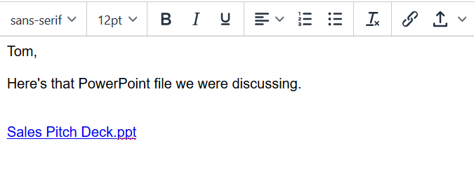

# 新增醒目提示內容至您的電子郵件 {#adding-highspot-content-to-your-email}

如果您是Highspot客戶，可以輕鬆地將Highspot內容插入Sales Connect電子郵件中。

1. 建立您的電子郵件草稿(有多種方式可以執行此操作，在此範例中，我們選擇 **撰寫** （在標題中）。

   

1. 填入「收件者」欄位並輸入「主旨」。

   

1. 按一下您要在電子郵件中插入Highspot內容的位置。 按一下箭頭下拉式清單（附件圖示旁）並選取 **亮點**.

   

1. 登入您的Highspot帳戶。

   

1. 選取您想要的內容，然後按一下 **新增內容** 按鈕。

   

   >[!NOTE]
   >
   >如果您沒有看到您要列出的內容，請使用頂端的搜尋列。

   

內容會在您的電子郵件中顯示為連結。 收件者可以按一下連結以檢視/下載內容。
