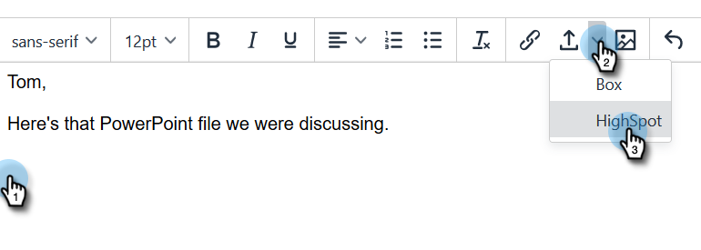

# 新增最高位置內容至您的電子郵件 {#adding-highspot-content-to-your-email}

如果您是Highspot客戶，您可以輕鬆地將Highspot內容插入Sales Connect電子郵件中。

1. 建立電子郵件草稿(有多種方法可執行此作業，在此範例中，我們選擇 **撰寫** 中)。

   

1. 填入「收件人」欄位並輸入主旨。

   

1. 按一下電子郵件中要插入「亮點」內容的位置。 按一下箭頭下拉式清單（附件圖示旁），然後選取 **高光點**.

   

1. 登入您的Highspot帳戶。

   

1. 選取您想要的內容，然後按一下 **新增內容** 按鈕。

   

   >[!NOTE]
   >
   >如果您沒有看到要列出的內容，請使用頂端的搜尋列。

   

內容會以連結的形式顯示在電子郵件中。 收件者可以按一下連結來檢視/下載內容。
