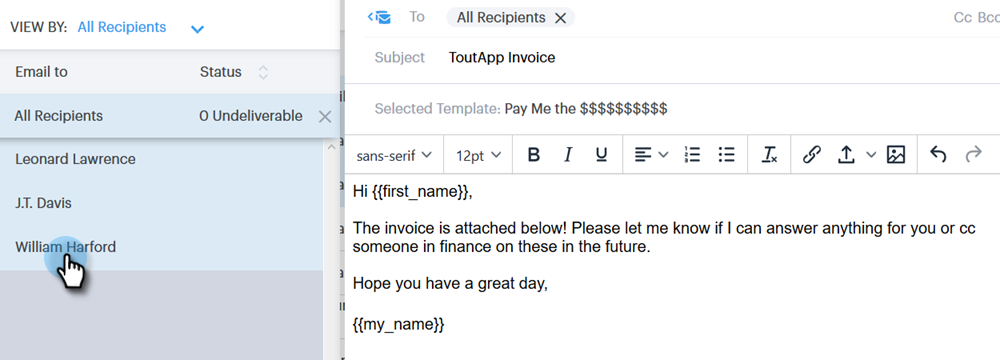
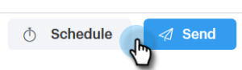

# 使用Select和Send {#composing-bulk-emails-with-select-and-send}合成大量電子郵件

以下說明如何使用「選取並傳送」選項來傳送／編輯電子郵件。

## 傳送電子郵件{#sending-emails}

1. 導覽至「人員」頁面。

   

1. 選擇您要以電子郵件傳送的對象。

   

   >[!NOTE]
   >
   >使用「選取並傳送」時，最多可選取200人。

1. 按一下&#x200B;**Email Selected**&#x200B;按鈕。

   

1. 輸入主旨行，選取範本（或從頭撰寫電子郵件），然後傳送/[排程](/help/marketo/product-docs/marketo-sales-connect/email/using-the-compose-window/scheduling-an-email.md)電子郵件。

   

   >[!NOTE]
   >
   >如果您選取範本，並想要檢查所有動態欄位在傳送前是否都正確填入，請按一下「預覽動態欄位&#x200B;**」。**&#x200B;確保已選取大量側邊欄中的所有收件者，以預覽所有電子郵件。 如果您選取一封電子郵件，然後按一下「預覽動態欄位」，則只會預覽該電子郵件。****

## 編輯電子郵件{#editing-emails}

**大量編輯**

1. 請遵循[傳送電子郵件區段](#sending-emails)中的步驟1-3。

   >[!NOTE]
   >
   >預設會選取所有收件者。 如果您按一下個人並想要重新選取每個人，請按一下「所有收件者」。 ****&#x200B;提醒您，必須選取所有收件者，才能進行大量編輯。

1. 在編輯器中進行變更。 您可以建立新電子郵件或編輯範本（在此範例中，我們要建立新電子郵件）。

   

   >[!NOTE]
   >
   >您可以按一下特定的電子郵件收件者，查看傳播至該電子郵件的變更。

1. 按一下「傳送&#x200B;****（或[排程](/help/marketo/product-docs/marketo-sales-connect/email/using-the-compose-window/scheduling-an-email.md)）」，以透過您進行的大量電子郵件更新傳送給所有收件者。

   

**編輯每封電子郵件**

在自訂每封電子郵件之前完成大量更新，因為大量更新會覆寫大量合成側欄中每封電子郵件的變更。

1. 請遵循[傳送電子郵件區段](#sending-emails)中的步驟1-4。

   >[!NOTE]
   >
   >預設會選取所有收件者。 如果您按一下個人並想要重新選取每個人，請按一下「所有收件者」。 ****&#x200B;提醒您，必須選取所有收件者，才能進行大量編輯。

1. 選擇個別收件者。

   

1. 在編輯器中進行變更。

   

   >[!NOTE]
   >
   >您可以在此處，在大量側欄中編輯單一電子郵件，而不需更新其餘的電子郵件。

   >[!TIP]
   >
   >您可以按一下其他收件者，查看您對先前選取之收件者所做的變更未顯示。

1. 按一下「傳送&#x200B;****（或[排程](/help/marketo/product-docs/marketo-sales-connect/email/using-the-compose-window/scheduling-an-email.md)）」，以透過您進行的大量電子郵件更新傳送給所有收件者。

   

   >[!MORELIKETHIS]
   >
   >* [大量傳送選項](/help/marketo/product-docs/marketo-sales-connect/email/using-the-compose-window/bulk-sending-options.md)
   >* [在合成窗口中使用模板](/help/marketo/product-docs/marketo-sales-connect/email/using-the-compose-window/using-a-template-in-the-compose-window.md)
   >* [動態欄位](/help/marketo/product-docs/marketo-sales-connect/templates/dynamic-fields/how-to-insert-dynamic-fields.md)

