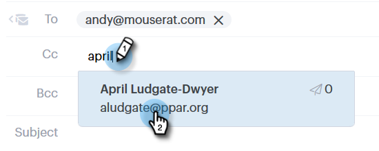

# 傳送追蹤的電子郵件 {#sending-a-tracked-email}

使用Marketo Sales Connect傳送電子郵件時，將會追蹤檢視（電子郵件開啟）和點按（已點按連結）。

>[!PREREQUISITES]
>
>在傳送追蹤的電子郵件之前，您需要先驗證身分並設定電子郵件傳送通道。
>
>* [驗證您的電子郵件地址](/help/marketo/product-docs/marketo-sales-connect/getting-started/email-settings/verify-your-email.md)
>* 為 [Outlook](/help/marketo/product-docs/marketo-sales-connect/email-plugins/msc-for-outlook/email-connection-for-outlook-users.md) 或 [Gmail](/help/marketo/product-docs/marketo-sales-connect/email-plugins/gmail/email-connection-for-gmail-users.md)

1. 建立電子郵件草稿(有多種方法可執行此作業，在此範例中，我們選擇 **撰寫** 中)。

   

1. 在 **結束日期** 欄位。

   

   >[!NOTE]
   >
   >「收件人」欄位中只能有一個人。

1. 在個別欄位中新增您要抄送或密件副本的任何收件者。

   

   >[!NOTE]
   >
   >如果是CC&#39;d或BCC&#39;d的人開啟了電子郵件，該開啟的電子郵件會記錄為該人的記錄中的檢視 **結束日期** 欄位。

1. 新增主旨行。

   

   >[!NOTE]
   >
   >傳送電子郵件需要主旨行和收件者。 我們會 **自動儲存草稿** 新增主旨行和收件者後。

1. 使用編輯器撰寫電子郵件。 按一下 **傳送** (或 [排程](/help/marketo/product-docs/marketo-sales-connect/email/using-the-compose-window/scheduling-an-email.md)，若您偏好)。

   

   >[!MORELIKETHIS]
   >
   >* [排程電子郵件](/help/marketo/product-docs/marketo-sales-connect/email/using-the-compose-window/scheduling-an-email.md)
   >* [範本](/help/marketo/product-docs/marketo-sales-connect/templates/create-a-new-template.md)

