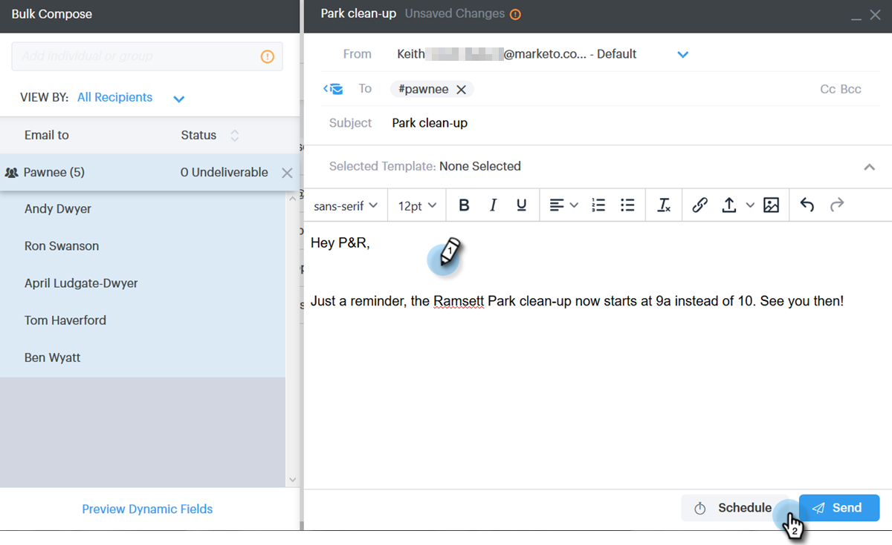
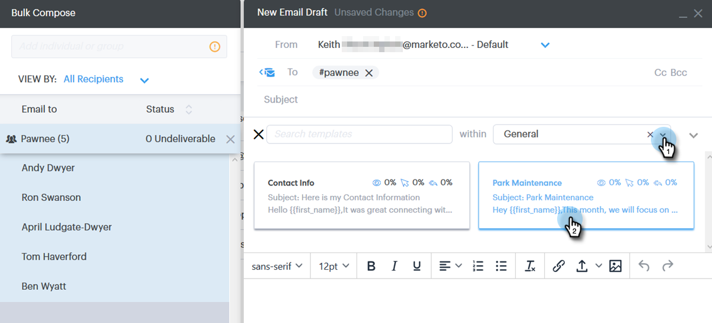

# 透過群組傳送電子郵件{#sending-emails-via-group-email}

以下說明如何使用「群組電子郵件」選項來傳送／編輯電子郵件。

## 傳送群組電子郵件{#sending-a-group-email}

1. 按一下&#x200B;**People**&#x200B;頁籤。

   

1. 選取您要以電子郵件傳送的群組。

   

1. 按一下「組操作」按鈕，然後選擇「電子郵件組」**。**

   

1. 填寫您的電子郵件（或選取範本）並傳送（或排程）。

   

## 編輯群組電子郵件{#editing-a-group-email}

1. 使用[上述步驟1-3建立群組電子郵件。](#sending-a-group-email)

1. 選擇範本，或填寫您的電子郵件。

   

1. 完成電子郵件後，您現在可以預覽清單中的每封電子郵件，查看動態欄位是否填入正確。

   

1. 選擇所要的收件者。

   

1. 按一下「預覽動態欄位」，並檢視右側的預覽。****

   

   >[!NOTE]
   >
   >在傳送群組電子郵件出去時，您可以對電子郵件／範本進行大量編輯，但無法對清單中的特定收件者進行唯一編輯。

>[!MORELIKETHIS]
>
>* [大量傳送選項](/help/marketo/product-docs/marketo-sales-connect/email/using-the-compose-window/bulk-sending-options.md)
>* [在合成窗口中使用模板](/help/marketo/product-docs/marketo-sales-connect/email/using-the-compose-window/using-a-template-in-the-compose-window.md)

