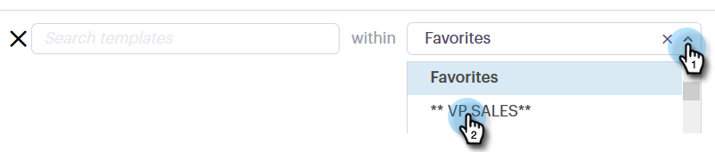

# 在撰寫視窗中使用範本 {#using-a-template-in-the-compose-window}

## 尋找和使用範本 {#finding-and-using-templates}

1. 建立電子郵件草稿(有多種方法可執行此作業，在此範例中，我們選擇 **撰寫** 中)。

   

1. 填入「收件人」欄位。

   

1. 按一下範本區段中的搜尋圖示，開啟範本搜尋欄位。

   

1. 選取要在中搜尋的類別（或選取全部以在所有類別間搜尋）。

   

1. 依範本名稱、主旨行或電子郵件內文進行搜尋。 按一下所需的範本以選取。

   

   >[!NOTE]
   >
   >選取另一個範本會取代編輯器中目前的所有資訊。 如果您進行任何變更，請務必先複製，再選取其他範本。

## 在撰寫視窗中釘選範本類別 {#pinning-template-categories-in-the-compose-window}

最愛 **最多五個** 特定範本類別，以快速存取您最常使用的範本。

1. 建立電子郵件草稿(有多種方法可執行此作業，在此範例中，我們選擇 **撰寫** 中)。

   

1. 按一下 **+** 表徵圖。

   

1. 按一下 **固定類別** 下拉式清單，然後選取您想要的類別。

   

1. 按一下 **儲存變更** 完成時（可選）:重複步驟3以新增更多內容)。

   

   >[!TIP]
   >
   >在保存更改之前，只需拖放即可重新排列固定的類別。

   

   >[!NOTE]
   >
   >**我的最愛** 預設為存在。 它包含最喜愛的電子郵件範本，而非類別。

   您選取的類別現在已固定。
