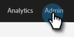

# 存取新的Sales Connect執行個體 {#accessing-your-new-sales-connect-instance}

>[!NOTE]
>
>**需要管理員許可權。**

購買Sales Connect後，您的Marketo執行個體中將會顯示新的整合頁面。 使用此頁面來邀請您的第一個使用者，並布建他們的Sales Connect執行個體。

1. 在Marketo中，按一下 **管理員**.

   

1. 按一下 **Sales Connect**.

   

1. 從Marketo管理員清單中選取以邀請並點選 **傳送邀請**.

   

使用者會收到電子郵件，其中包含存取Sales Connect帳戶的步驟。

>[!NOTE]
>
>其他使用者將 **not** 透過Marketo新增，而是透過Sales Connect的「使用者管理」頁面新增。 [按一下這裡](/help/marketo/product-docs/marketo-sales-connect/admin/invite-users.md) 以進一步瞭解如何新增其他使用者。
