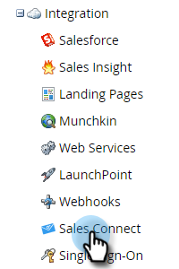

# 訪問新銷售連接實例{#accessing-your-new-sales-connect-instance}

>[!NOTE]
>
>**需要管理員權限。**

購買Sales Connect後，您的Marketo實例中將會顯示新的整合頁面。 使用此頁可以邀請您的第一個用戶並布建其Sales Connect實例。

1. 在Marketo，按一下&#x200B;**管理**。

   

1. 按一下&#x200B;**Sales Connect**。

   

1. 從要邀請的Marketo管理員清單中選擇，然後按一下「傳送邀請」。****

   

使用者將會收到電子郵件，內含存取Sales Connect帳戶的步驟。

>[!NOTE]
>
>其他使用者將&#x200B;**not**&#x200B;透過Marketo新增，而將透過Sales Connect的「使用者管理」頁面新增。 [按一](/help/marketo/product-docs/marketo-sales-connect/admin/invite-users.md) 下這裡以進一步瞭解新增其他使用者。
