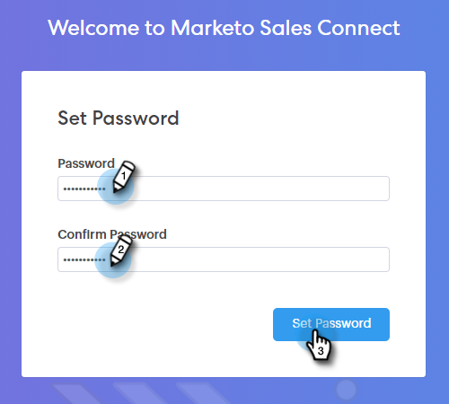

# 變更您的Sales Connect密碼 {#change-your-sales-connect-password}

需要變更您的密碼嗎？ 方法如下。

## 在登入時變更您的密碼 {#change-your-password-while-signed-in}

1. 按一下齒輪圖示並選取&#x200B;**[!UICONTROL Settings]**。

   

1. 您的[!UICONTROL My Profile]頁面預設會開啟。 在[!UICONTROL Account Details]底下，選取&#x200B;**[!UICONTROL Change password]**&#x200B;核取方塊。

   

1. 輸入您目前的密碼。 然後，輸入您的新密碼，然後重新輸入以確保它們相符。 完成時，按一下&#x200B;**[!UICONTROL Save]**。

   

>[!NOTE]
>
>密碼必須：
>
>* 至少包含九個字元
>* 使用混合大小寫（UPPER和LOWER）
>* 包含數字
>* 使用特殊字元

## 在登出時變更您的密碼 {#change-your-password-while-signed-out}

1. 瀏覽至[Sales Connect登入](https://toutapp.com/login)頁面，然後按一下&#x200B;**[!UICONTROL Forgot password?]**。

   

1. 輸入與帳戶關聯的電子郵件地址，然後按一下&#x200B;**[!UICONTROL Send Reset Email]**。

   

1. 我們將傳送電子郵件以確認帳戶擁有者想要變更密碼。 按一下「**[!UICONTROL Reset Password]**」。

   

   >[!NOTE]
   >
   >也請務必檢查您的「垃圾訊息」資料夾，因為此電子郵件有時可能最終會寄到那裡。

1. 輸入並確認您的新密碼。 完成時，按一下&#x200B;**[!UICONTROL Set Password]**。

   
