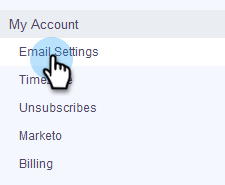

# 驗證您的電子郵件 {#verify-your-email}

如果您有未驗證的電子郵件身分，請遵循以下步驟。

1. 按一下右上方的齒輪圖示，然後選擇&#x200B;**[!UICONTROL Settings]**。

   

1. 在[!UICONTROL My Account]底下，按一下&#x200B;**[!UICONTROL Email Settings]**。

   

1. 在[!UICONTROL Address and Signature]下方，找到您要驗證的電子郵件身分識別，然後按一下&#x200B;**[!UICONTROL Resend Verify Email]**。 將會傳送新的驗證電子郵件。

   

1. 按一下「**[!UICONTROL Resend]**」。

   

1. 收件者接著會開啟電子郵件，並依照步驟驗證電子郵件身分。

   
