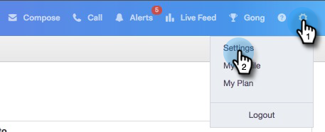

# Sales Connect {#getting-started-with-sales-connect}快速入門

如果您不想看這些步驟，而是直接跳至[下面的「Video Instructions（視頻說明）」。](#video)

>[!AVAILABILITY]
>
>並非所有客戶都購買過此功能。 如需詳細資訊，請連絡您的客戶成功經理。

## 開始使用{#what-you-need-to-get-started}所需內容

* Marketo訂閱
* Sales Connect訂閱
* Salesforce訂閱（啟用API呼叫和Apex類別）

## 您需要開始使用的{#who-you-need-to-get-started}

* 行銷人員管理員使用者
* Sales Connect管理員使用者
* Salesforce管理員
* Sales Connect用戶

## 銷售連線管理員{#sales-connect-admins}

您將會收到Marketo寄來的電子郵件，內含重設密碼的連結。 建立新密碼後，請登錄到Sales Connect。

要完成設定，您必須執行以下操作：

* [Connect Sales Connect和Salesforce](#sfdc)
* [在將Sales Connect與Marketto連接之前取得認證](#acquire)
* [Connect Sales Connect與Marketo](#mkto)
* [邀請／布建使用者](#IPU)

或者，您也可以：

* [在沙盒中測試銷售連線](#sandbox)

## 將您的Sales Connect帳戶連接至Salesforce {#connect-your-sales-connect-account-to-salesforce}

若要以管理員或非管理員身分將您的Sales Connect帳戶連接至您的Salesforce帳戶，請遵循本文[中的步驟。](https://docs.marketo.com/x/JwDb)

>[!NOTE]
>
>您所連接的Salesforce例項必須與已（或將）連線至Marketo的例項相同。

## 在將Sales Connect與Marketon連接至{#acquiring-credentials-prior-to-connecting-sales-connect-with-marketo}之前獲取憑據

您必須從Marketo取得一組認證。 Sales Connect管理員稍後將會使用這些認證，將Marketo與Sales Connect連接。

1. 在Marketo中，按一下&#x200B;**管理**。

   

1. 在樹中，按一下&#x200B;**Sales Connect**。

   

1. 選取下列Marketo憑證並傳送給您的Sales Connect管理員：Munchkin ID、用戶端ID、用戶端密碼。

   

   >[!NOTE]
   >
   >複製並貼上上述資訊時，請確定未新增空格。

## 將Sales Connect連接到Marketo {#connect-sales-connect-to-marketo}

1. 在Sales Connect中，按一下齒輪表徵圖並選擇&#x200B;**Settings**。

   

1. 在「管理設定」下，選取「**行銷人員**」。

   

1. 輸入行銷人員提供的行銷人員認證，然後按一下&#x200B;**Connect**。

   

## 邀請／布建使用者{#invite-provision-users}

如果您的帳戶（先前來自ToutApp）上已有任何使用者，他們會顯示在Sales Connect「Marketo」區段的「團隊存取」標籤中。****

您可以從此頁面將您的團隊布建為Marketo Sales Connect使用者。 如果您從未使用過ToutApp，或尚未邀請使用者，請依照本文[中的步驟進行。](https://docs.marketo.com/display/TOUT/Invite+Team+Members)

>[!CAUTION]
>
>在將Sales Connect與Marketto連接後，請等待10分鐘，然後再執行這些步驟。

1. 選擇一個或多個用戶，然後按一下&#x200B;**Connect**。

   >[!NOTE]
   >
   >在邀請用戶時，您只能執行一次工作區分配。 設定後，您必須先將使用者中斷連線，才能加以變更。

   

1. 如果您的Marketo訂閱已啟用工作區，您將能夠大量指派工作區給每個使用者或一組使用者。 如果未選取任何工作區，我們會將它們指派至「預設行銷人員」工作區。

   

1. 按一下「工作區」下拉式清單，選取您想要的工作區，然後按一下「連線」。****

   

   >[!NOTE]
   >
   >如果您想新增使用者，請前往「管理設定」的「團隊管理」區段，然後按一下「邀請使用者」按鈕。****

您可以從「團隊管理」頁面，讓其他使用者依照上述步驟連線。

## 在沙盒中測試銷售連接{#test-sales-connect-in-your-sandbox}

對於想要透過其Marketo Sandbox測試Marketo Sales Connect的團隊，可應要求提供額外的Sales Connect帳戶。 這僅適用於購買Marketo Sandbox的客戶，或是作為Marketo搭售的一部分而擁有Marketo的客戶。 如果您有興趣取得沙盒，請連絡您的Marketo客戶經理。

>[!NOTE]
>
>您無法將具有相同電子郵件ID的Sales Connect帳戶布建至多個例項。 這表示，如果您想要有額外的Sales Connect帳戶來測試您的Marketo Sandbox執行個體，則需要在每個帳戶中使用不同的電子郵件ID。
