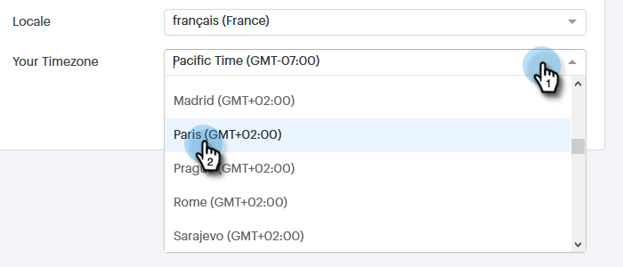

# 管理您的設定檔 {#manage-your-profile}

在「我的設定檔」頁面中，您可以更新您的名稱、帳戶的語言/地區設定/時區，也可以變更密碼。

## 帳戶詳細資料 {#account-details}

您可以在此處更新您的名稱和/或密碼。

1. 按一下齒輪圖示並選取 **設定**.

   

1. 您的「我的設定檔」頁面預設會開啟。 若要更新您的名稱，只需輸入變更並按一下 **儲存**.

   

>[!NOTE]
>
>您的電子郵件地址已設定為僅供檢視。 如果您也需要變更，請聯絡 [Marketo支援](https://nation.marketo.com/t5/Support/ct-p/Support).

您也可以在此區段中變更您的密碼。 本檔案將概述這些步驟。

## 您的整合 {#your-integrations}

在頁面的右側，您的整合區段提供您帳戶所有連線的狀態。

>[!NOTE]
>
>如果您使用Exchange On Prem搭配Sales Connect，則不會更新傳遞管道（第一行專案）或回覆追蹤（第二行專案）整合健康狀態檢查。 我們正努力在未來的版本中支援此功能。

## 時區 {#time-zone}

以下說明如何變更帳戶的語言、地區設定及/或時區。

>[!NOTE]
>
>支援的語言：英文、法文、德文、日文、葡萄牙文、西班牙文。

1. 按一下齒輪圖示並選取 **設定**.

   

1. 若要變更您的語言，請按一下 **語言** 下拉式清單並做出您的選擇。

   

1. 這裡的地區設定是指使用者說該語言的地區。 按一下 **地區設定** 下拉式清單並做出您的選擇。

   

1. 按一下 **您的時區** 下拉式清單並做出您的選擇。

   

1. 按一下 **儲存** 完成時。

   

敬請期待！
