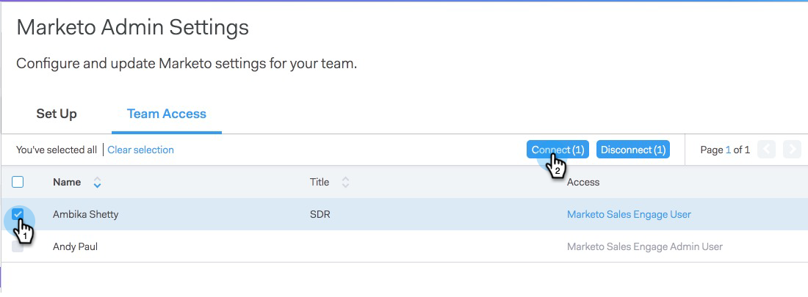

# 授予使用者存取權 {#granting-access-to-users}

請依照本文的步驟操作，授與您的[!DNL Sales Connect]使用者存取Marketo連線的許可權。 這將可解鎖「即時摘要」中「有趣時刻」等功能以及行銷活動的存取權。

您必須先邀請使用者[!DNL Sales Connect] [在此](/help/marketo/product-docs/marketo-sales-connect/admin/invite-users.md)，才能在Marketo > [!UICONTROL Team Access]頁面（在[!DNL Sales Connect]）中看到這些使用者，該頁面授予Marketo連線的存取權。

>[!CAUTION]
>
>將[!DNL Sales Connect]與Marketo連線後，請等待10分鐘再執行這些步驟。

1. 選取一或多個使用者，然後按一下&#x200B;**[!UICONTROL Connect]**。

   >[!NOTE]
   >
   >您只能在授予使用者存取權時執行一次工作區指派。 設定後，您必須中斷使用者的連線才能進行變更。

   

1. 如果您的Marketo訂閱已啟用工作區，您可以將工作區大量指派給每位使用者或一組使用者。 如果未選取任何工作區，我們會將其指派至預設Marketo工作區。

   

1. 按一下Workspace下拉式清單，選取您想要的工作區，然後按一下&#x200B;**[!UICONTROL Connect]**。

   

您可以從「專案團隊管理」頁面中取得其他使用者，並依照上述步驟連線到他們。
