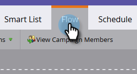

# 讓Sales Connect使用者看到行銷活動 {#make-a-campaign-visible-to-sales-connect-users}

行銷活動只有在顯示後才可共用。 以下說明該怎麼做。

1. 選取（或建立）您要共用的行銷活動。

   

1. 按一下&#x200B;**智慧清單**&#x200B;索引標籤。

   

1. 新增Campaign is Requested觸發程式。

   

1. 針對來源，請選擇[是] **Web服務API**。

   

1. 按一下「**流量**」標籤。

   

1. 新增「有趣的時刻流量」動作。

   

1. 對於型別，請選取&#x200B;**網頁**。

   

1. 在「說明」方塊中，寫訊息給您的銷售團隊。 在此範例中，我們使用代號來指定已填寫的表單。

   

1. 按一下&#x200B;**排程**&#x200B;索引標籤並&#x200B;**啟動**&#x200B;行銷活動。

   
