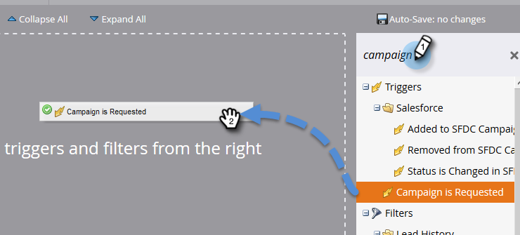

# 讓[!DNL Sales Connect]個使用者看到行銷活動 {#make-a-campaign-visible-to-sales-connect-users}

行銷活動只有在顯示後才可共用。 以下說明該怎麼做。

1. 選取（或建立）您要共用的行銷活動。

   

1. 按一下「**[!UICONTROL Smart List]**」標籤。

   

1. 新增[!UICONTROL Campaign is Requested]觸發器。

   

1. 針對來源，請選擇[!UICONTROL is] **[!UICONTROL Web Service API]**。

   

1. 按一下「**[!UICONTROL Flow]**」標籤。

   

1. 新增[!UICONTROL Interesting Moment]流程動作。

   

1. 針對 [!UICONTROL Type]，請選取 **[!UICONTROL Web]**。

   

1. 在[!UICONTROL Description]方塊中，寫訊息給您的銷售團隊。 在此範例中，我們使用代號來指定已填寫的表單。

   

1. 按一下「**[!UICONTROL Schedule]**」標籤，然後&#x200B;**[!UICONTROL Activate]**&#x200B;促銷活動。

   
