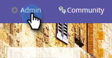

# 手動設定Marketo連接{#manually-set-up-your-marketo-connection}

>[!NOTE]
>
>當您布建MSC時，Marketo會自動將您的認證傳送給Sales Connect，並將您的實例連接至Marketo。 如果您沒有看到在布建Sales Connect實例後建立的連接，則此步驟僅為&#x200B;****。 如果已建立連線，您會在「Marketo管理設定」頁面上看到您輸入的認證。

## 在連接銷售連接與Marketo{#acquiring-credentials-prior-to-connecting-sales-connect-with-marketo}之前獲取憑據

你需要從Marketo得到一組認證。 Sales Connect管理員稍後將使用這些認證來連接Marketo與Sales Connect。

1. 在Marketo，按一下&#x200B;**管理**。

   

1. 在樹中，按一下&#x200B;**Sales Connect**。

   

1. 選擇以下Marketo認證並傳送給您的Sales Connect管理員：Munchkin ID、用戶端ID、用戶端密碼。

   

   >[!NOTE]
   >
   >複製並貼上上述資訊時，請確定未新增空格。

## 將銷售連接連接到Marketo{#connect-sales-connect-to-marketo}

1. 在Sales Connect中，按一下齒輪表徵圖並選擇&#x200B;**Settings**。

   

1. 在「管理設定」下，選擇&#x200B;**Marketo**。

   

1. 輸入Marketo管理員提供的Marketo證書，然後按一下&#x200B;**Connect**。

   
