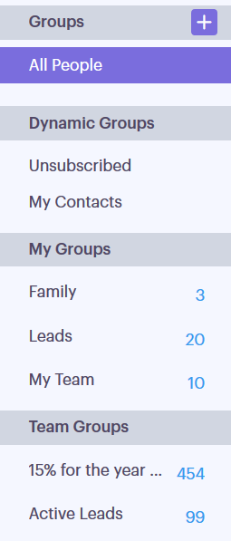

# 群組類型{#group-types}

瞭解Sales Connect中的不同群組類型。

<table> 
 <colgroup> 
  <col> 
  <col> 
 </colgroup> 
 <tbody> 
  <tr> 
   <th>群組</th> 
   <th>說明</th> 
  </tr> 
  <tr> 
   <td>
所有人
</td> 
   <td>所有使用者的所有連絡人，您都能看見。</td> 
  </tr> 
  <tr> 
   <td colspan="1">
動態群組
</td> 
   <td colspan="1">我的聯繫人：您擁有的所有聯絡人。 取消訂閱：已選擇不收到信件的聯絡人。</td> 
  </tr> 
  <tr> 
   <td>
我的群組
</td> 
   <td>您建立的群組。 它們可以包含您的聯繫人或已與您共用的聯繫人。</td> 
  </tr> 
  <tr> 
   <td>
團隊群組
</td> 
   <td>已與和／或您共用的群組。 他們可以包含您隊友的聯繫人，或者您與他們共用的聯繫人。</td> 
  </tr> 
 </tbody> 
</table>
