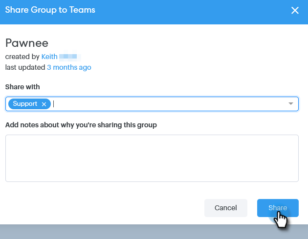

# 如何共用群組 {#how-to-share-a-group}

在Sales Connect中，與團隊共用一組潛在客戶或聯絡人非常簡單。

1. 前往「人 **員** 」標籤。

   

1. 選取您要共用的群組。

   

1. 按一下**「群組動作」**按鈕，並選取「共 **用群組」**。

   

1. 選擇要與共用的子團隊，並為團隊添加附註。

   

1. 按一 **下共用**。

   

