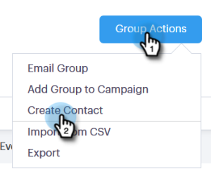

# 管理群組 {#manage-groups}

瞭解如何在[!DNL Sales Connect]中管理您的群組。

## 建立群組 {#create-a-group}

1. 在[!UICONTROL People]頁面中，按一下&#x200B;**旁的**+[!UICONTROL Groups]。

   

1. 命名您的群組並按一下&#x200B;**[!UICONTROL Create]**。

   

   完成了！

## 新增連絡人至群組 {#add-contacts-to-a-group}

1. 在[!UICONTROL People]頁面中，尋找並選取您要新增人員的群組。

   

1. 按一下&#x200B;**[!UICONTROL Group Actions]**&#x200B;並選取&#x200B;**[!UICONTROL Create Contact]**。

   

   >[!NOTE]
   >
   >這將會一次新增一個連絡人。 若要同時新增多個連絡人，請遵循[這些步驟](/help/marketo/product-docs/marketo-sales-connect/people/managing-contacts/import-contacts-via-csv.md)。

1. 填寫連絡人資訊，然後按一下&#x200B;**[!UICONTROL Create]** （或&#x200B;**[!UICONTROL Create and Add New]**&#x200B;新增其他連絡人）。

   

   而您已完成！

   >[!NOTE]
   >
   >您可能必須點選「重新整理」才能檢視任何新增的連絡人。

## 共用群組 {#share-a-group}

1. 在[!UICONTROL People]頁面中，尋找並選取您要共用的群組。

   

1. 按一下dota （三個垂直點）並選取&#x200B;**[!UICONTROL Share]**。

   

1. 按一下下拉式清單，然後選擇您要共用群組的團隊。

   

1. 按一下「**[!UICONTROL Share]**」。

   

   您仍擁有群組，但它現在會顯示在[!UICONTROL Team Groups]下方。

## 取消共用群組 {#unshare-a-group}

1. 在[!UICONTROL People]頁面中，尋找並選取您要取消共用的群組。

   

1. 按一下dota （三個垂直點）並選取&#x200B;**[!UICONTROL Share]**。

   

1. 按一下您共用群組的團隊旁的&#x200B;**X**，然後按一下退出強制回應視窗。

   

   群組現在會取消共用。

## 重新命名群組 {#rename-a-group}

1. 在[!UICONTROL People]頁面中，尋找並選取您要重新命名的群組。

   

1. 按一下dota （三個垂直點）並選取&#x200B;**[!UICONTROL Rename]**。

   

1. 輸入新名稱，然後按一下Enter。

   

## 刪除群組 {#delete-a-group}

1. 在[!UICONTROL People]頁面中，尋找並選取您要刪除的群組。

   

1. 按一下dota （三個垂直點）並選取&#x200B;**[!UICONTROL Delete]**。

   

1. 按一下&#x200B;**[!UICONTROL Delete]**&#x200B;確認。

   
