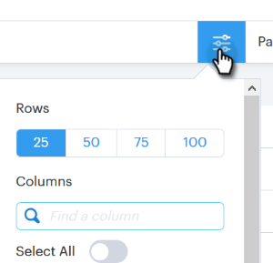
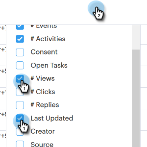

# 人員頁面欄{#people-page-columns}

您可以選擇顯示哪些欄，以自訂您看到的連絡資訊。

## 如何選擇列{#how-to-select-columns}

1. 在「人員」頁面中，按一下「清單設定」圖示。

   

1. 捲動並選取您想要的欄（如果您想要每欄，也可以按一下「全選&#x200B;**」）。**&#x200B;完成時，從清單中按一下。

   

## 欄說明{#column-descriptions}

<table> 
 <colgroup> 
  <col> 
  <col> 
 </colgroup> 
 <tbody> 
  <tr> 
   <th>欄</th> 
   <th>說明</th> 
  </tr> 
  <tr> 
   <td>名字（預設值）</td> 
   <td>名字</td> 
  </tr> 
  <tr> 
   <td>姓氏（預設值）</td> 
   <td>姓氏</td> 
  </tr> 
  <tr> 
   <td colspan="1">電子郵件（預設）</td> 
   <td colspan="1">電子郵件地址</td> 
  </tr> 
  <tr> 
   <td colspan="1">電話</td> 
   <td colspan="1">電話號碼</td> 
  </tr> 
  <tr> 
   <td colspan="1">標題（預設）</td> 
   <td colspan="1">職稱</td> 
  </tr> 
  <tr> 
   <td>公司（預設值）</td> 
   <td>公司名稱</td> 
  </tr> 
  <tr> 
   <td>促銷活動（預設）</td> 
   <td>人員目前所在的銷售促銷活動</td> 
  </tr> 
  <tr> 
   <td>促銷活動數</td> 
   <td>該人員參與的銷售促銷活動總數</td> 
  </tr> 
  <tr> 
   <td>呼叫數</td> 
   <td>向此人員發出的呼叫總數</td> 
  </tr> 
  <tr> 
   <td>#電子郵件</td> 
   <td>傳送給此人的電子郵件總數</td> 
  </tr> 
  <tr> 
   <td>任務到期日</td> 
   <td>任務的到期日</td> 
  </tr> 
  <tr> 
   <td>事件數（預設值）</td> 
   <td>參與事件的總次數（檢視次數、點按次數和回覆）</td> 
  </tr> 
  <tr> 
   <td>活動數（預設值）</td> 
   <td>使用者為此潛在客戶（電子郵件、來電和任務）執行的活動總數</td> 
  </tr> 
  <tr> 
   <td>同意</td> 
   <td>
合法利益、履行合約、遵守法律義務、保護重大利益、公共利益／官方機關及其他
</td> 
  </tr> 
  <tr> 
   <td>未結任務</td> 
   <td>此人員的未結任務數</td> 
  </tr> 
  <tr> 
   <td>檢視次數</td> 
   <td>此人的檢視總數</td> 
  </tr> 
  <tr> 
   <td>點按次數</td> 
   <td>此人點按的總次數</td> 
  </tr> 
  <tr> 
   <td>回覆數</td> 
   <td>此人的回覆總數</td> 
  </tr> 
  <tr> 
   <td>上次更新日期</td> 
   <td>上次更新人員記錄的日期：</td> 
  </tr> 
  <tr> 
   <td>製作程式</td> 
   <td>建立人員的用戶名</td> 
  </tr> 
  <tr> 
   <td>來源</td> 
   <td>建立人員的來源</td> 
  </tr> 
  <tr> 
   <td>群組（預設）</td> 
   <td>人員所屬的群組</td> 
  </tr> 
  <tr> 
   <td colspan="1">取消訂閱</td> 
   <td colspan="1">銷售取消訂閱狀態</td> 
  </tr> 
 </tbody> 
</table>
