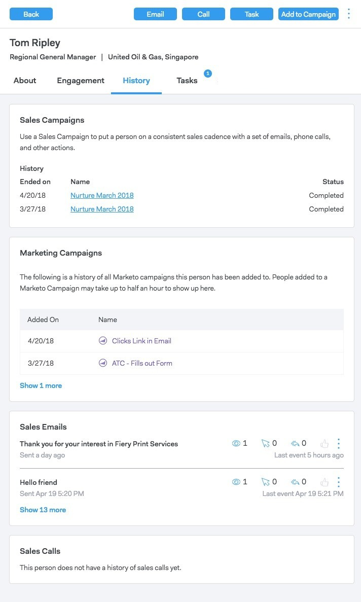

# 人員詳細資訊視圖 {#person-detail-view}

「人員詳細資訊」視圖提供MSC帳戶中每個人員的詳細資訊。

## 如何存取 {#how-to-access}

1. 若要存取人員詳細資料檢視，請按一下 **人員** 標籤。

   

1. 按一下所需的人員。

   

   >[!TIP]
   >
   >幾乎無論您在何處看到某人的姓名，都可以按一下該姓名，然後進入其「人員詳細資訊檢視」。

## 關於標籤 {#about-tab}

包括該人員的所有聯繫資訊。

**聯繫卡**

* 包含以下聯繫資訊：電子郵件地址、姓名、公司、標題、電話號碼及社交媒體連結

**群組**

* 顯示並管理此人員所屬的群組

**帳戶資訊**

* 可以將人員添加到Salesforce
* 從Salesforce提取帳戶和銷售機會/聯繫資訊

**自訂欄位**

* 新增或移除可在範本和行銷活動中用作動態欄位的自訂欄位

**備註**

* 建立自訂附註

## 參與標籤 {#engagement-tab}

了解此人如何參與您的外展活動。

**Sales Connect活動**

* 查看您銷售電子郵件和行銷活動中的參與活動

**行銷活動**

* 了解您的人員如何參與行銷活動

## 「歷史記錄」頁簽 {#history-tab}

顯示您的外展歷史。 包括電子郵件、行銷活動和呼叫。

**銷售活動**

* 查看此人員所屬的任何有效或已完成的促銷活動

**行銷活動**

* 查看此人所屬的任何行銷活動

**銷售電子郵件**

* 查看您傳送給此人員的任何電子郵件及參與量度

**銷售呼叫**

* 查看您對此人進行的任何呼叫

## 任務頁簽 {#tasks-tab}

管理與此人員關聯的任務。

您可以執行的動作：

* 編輯或刪除任務
* 查看到期日
* 按一下「類型」以啟動「呼叫時」、「電子郵件時撰寫電子郵件時」、「郵件時撰寫Linkedin」、「自訂時自訂附註」。
* 將任務標籤為已完成
