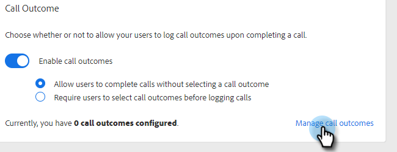
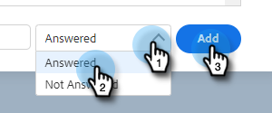
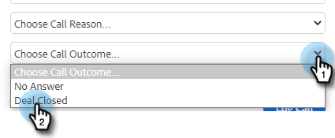

# 呼叫結果 {#call-outcomes}

允許您的銷售團隊在進行呼叫時選擇呼叫結果，以便您的團隊能夠瞭解客戶參與工作的影響。

>[!NOTE]
>
>**需要管理權限。**

## 啟用呼叫結果 {#enable-call-outcomes}

1. 按一下齒輪表徵圖並選擇 **設定**。

   

1. 在「管理設定」下選擇 **撥號器**。

   

1. 選擇 **啟用呼叫結果**。

   

1. 選擇所需的呼叫結果要求。

   

## 建立呼叫結果 {#create-call-outcomes}

>[!NOTE]
>
>最多可建立15個呼叫結果。

1. 按一下齒輪表徵圖並選擇 **設定**。

   

1. 在「管理設定」下選擇 **撥號器**。

   

1. 按一下 **管理呼叫結果**。

   

1. 在文本欄位中輸入所需的呼叫結果名稱。

   

1. 按一下「已應答」(Answered)下拉清單並選擇結果類型（在本示例中，我們選擇「已應答」）。 然後按一下 **添加**。

   

## 選擇呼叫結果 {#choose-a-call-outcome}

啟用呼叫結果後。 用戶可在撥打電話時選擇一個。

1. 按一下呼叫按鈕啟動撥號器。

   

1. 在撥號器中輸入呼叫資訊，然後按一下 **呼叫**。

   

1. 選擇最能描述呼叫的呼叫結果。

   

1. 結束通話。

   

1. 記錄呼叫。

   

>[!MORELIKETHIS]
>
>* [將呼叫原因和呼叫結果記錄到Salesforce](/help/marketo/product-docs/marketo-sales-connect/phone/log-call-reasons-and-call-outcomes-to-salesforce.md)
>* [呼叫原因](/help/marketo/product-docs/marketo-sales-connect/phone/call-reasons.md)

