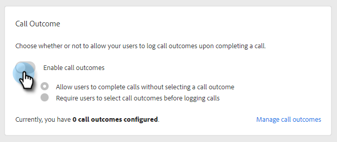

# 呼叫結果 {#call-outcomes}

讓您的銷售團隊在進行通話時選取通話結果，以便您的團隊瞭解客戶參與工作的影響。

>[!NOTE]
>
>**需要系統管理員許可權。**

## 啟用呼叫結果 {#enable-call-outcomes}

1. 按一下齒輪圖示並選取&#x200B;**[!UICONTROL Settings]**。

   

1. 在[!UICONTROL Admin Settings]底下選取&#x200B;**[!UICONTROL Dialer]**。

   

1. 選擇「**[!UICONTROL Enable call outcomes]**」。

   

1. 選擇您想要的通話結果需求。

   

## 建立通話結果 {#create-call-outcomes}

>[!NOTE]
>
>您最多可以建立15個通話結果。

1. 按一下齒輪圖示並選取&#x200B;**[!UICONTROL Settings]**。

   

1. 在[!UICONTROL Admin Settings]底下選取&#x200B;**[!UICONTROL Dialer]**。

   

1. 按一下「**[!UICONTROL Manage call outcomes]**」。

   

1. 在文字欄位中輸入您想要的通話結果名稱。

   

1. 按一下[!UICONTROL Answered]下拉式清單，然後選擇結果型別（在此範例中，我們將選擇[已回答]）。 然後按一下「**[!UICONTROL Add]**」。

   

## 選擇通話結果 {#choose-a-call-outcome}

啟用呼叫結果後。 使用者可以在進行呼叫時選取一個專案。

1. 按一下呼叫按鈕以啟動撥號器。

   

1. 在撥號器中輸入通話資訊，然後按一下&#x200B;**[!UICONTROL Call]**。

   

1. 選取最能描述通話的通話結果。

   

1. 結束呼叫。

   

1. 記錄呼叫。

   

>[!MORELIKETHIS]
>
>* [將通話原因和通話結果記錄到Salesforce](/help/marketo/product-docs/marketo-sales-connect/phone/log-call-reasons-and-call-outcomes-to-salesforce.md)
>* [來電原因](/help/marketo/product-docs/marketo-sales-connect/phone/call-reasons.md)
