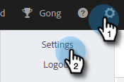

# 呼叫原因 {#call-reasons}

允許您的銷售團隊在進行呼叫時選擇呼叫原因，以便您的團隊了解進行呼叫的原因。

>[!NOTE]
>
>**需要管理員權限。**

## 啟用呼叫原因 {#enable-call-reasons}

1. 按一下齒輪圖示並選取 **設定**.

   

1. 在「管理設定」下，選取 **撥號器**.

   

1. 選擇 **啟用呼叫原因**.

   

1. 選擇所需的呼叫原因要求。

   

## 建立呼叫原因 {#create-call}

1. 按一下齒輪圖示並選取 **設定**.

   

1. 在「管理設定」下，選取 **撥號器**.

   

1. 按一下 **管理呼叫原因**.

   

1. 在文本欄位中輸入所需的呼叫原因名稱，然後按一下 **新增**.

   

## 選擇呼叫原因 {#select-a-call-reason}

啟用呼叫原因後。 使用者可在進行呼叫時選取一個選項。

1. 按一下呼叫按鈕以啟動撥號器。

   

1. 在撥號器中輸入呼叫資訊，然後按一下 **呼叫**.

   

1. 選取最能說明呼叫的呼叫原因。

   

1. 結束呼叫。

   

1. 記錄呼叫。

   

>[!MORELIKETHIS]
>
>* [將呼叫原因和呼叫結果記錄到Salesforce](/help/marketo/product-docs/marketo-sales-connect/phone/log-call-reasons-and-call-outcomes-to-salesforce.md)
>* [呼叫結果](/help/marketo/product-docs/marketo-sales-connect/phone/call-outcomes.md)

