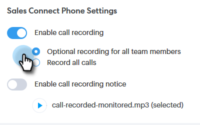

# 啟用通話錄製 {#enable-call-recording}

身為管理員，您可以為Sales Connect通話啟用通話錄製。 記錄團隊的電話是指導銷售代表最佳通話實務的絕佳方式。

1. 按一下設定圖示並選取 **設定**.

   

1. 在「管理設定」底下，按一下 **一般**.

   

1. 向下捲動至Sales Connect電話設定，並選取 **啟用通話錄製** 切換。

   

1. 如果您想要讓銷售者能夠自行啟用或停用通話錄製，請按一下 **所有團隊成員的可選錄製**. 如果您要自動記錄所有呼叫，請按一下 **記錄所有通話**.

   

>[!MORELIKETHIS]
>
>[雙方同意設定](/help/marketo/product-docs/marketo-sales-connect/phone/two-party-consent-settings.md)
