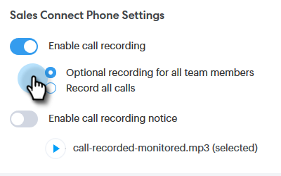

# 啟用通話錄音 {#enable-call-recording}

身為管理員，您可以啟用[!DNL Sales Connect]通話的通話錄製。 記錄團隊的電話是指導銷售代表最佳電話慣例的好方法。

1. 按一下「設定」圖示並選取&#x200B;**[!UICONTROL Settings]**。

   

1. 在[!UICONTROL Admin Settings]底下，按一下&#x200B;**[!UICONTROL General]**。

   

1. 向下捲動至「[!DNL Sales Connect]電話設定」並選取「**[!UICONTROL Enable call recording]**」切換按鈕。

   

1. 如果您想要讓賣家能夠自行啟用或停用通話錄製，請按一下&#x200B;**[!UICONTROL Optional recording for all team members]**。 如果您要自動記錄所有通話，請按一下&#x200B;**[!UICONTROL Record all calls]**。

   

>[!MORELIKETHIS]
>
>[雙方同意設定](/help/marketo/product-docs/marketo-sales-connect/phone/two-party-consent-settings.md)
