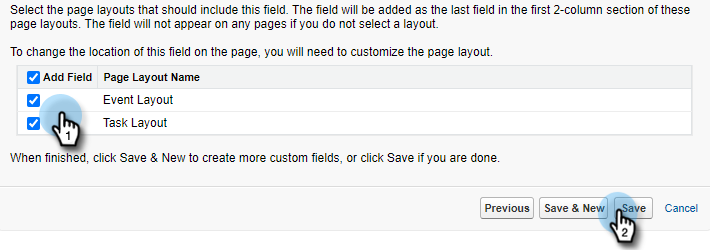
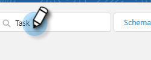

# 將呼叫原因和呼叫結果記錄到Salesforce {#log-call-reasons-and-call-outcomes-to-salesforce}

如果您希望將呼叫結果和呼叫原因記錄到Salesforce以用於報告或查看，則可以為每個欄位建立一個自定義活動欄位。 每個欄位必須使用特定的API名稱（在Salesforce中稱為「欄位名稱」）。

* 呼叫結果欄位名稱：mktosales_call_outce
* 呼叫原因欄位名稱：mktosales_call_reason

要利用這些欄位，您首先需要將該欄位建立為自定義活動欄位。 為了使用戶可見，您需要將其添加到任務對象頁面佈局中。

## Salesforce經典 {#salesforce-classic}

### 在Salesforce經典中建立自定義活動欄位  {#create-custom-activity-field-in-salesforce-classic}

1. 在Salesforce中，按一下 **設定**。

   

1. 在「快速查找」(Quick Find)框中鍵入「活動」(Activities)。

   

1. 按一下 **活動自定義欄位**。

   

1. 按一下 **新建**。

   

1. 選擇資料類型「文本」，然後按一下 **下一個**。

   

1. 為自定義欄位指定上面定義的欄位名稱。 欄位長度有255個字元的限制。 「欄位標籤」將是您的銷售團隊可見的欄位，並可以自定義以滿足您團隊的需求。

   

1. 其餘設定為可選。 完成配置後，按一下 **下一個**。

   

1. 選擇此欄位所需的欄位級安全設定，然後按一下 **下一個** （下面的影像只是一個示例）。

   

   >[!NOTE]
   >
   >確保自定義欄位對您的Sales Connect用戶使用的配置檔案以及您希望其在此處顯示的任何內容可見。

1. 選擇要將欄位添加到的頁面佈局，然後按一下 **保存** （可選）您可以按一下 **保存並新建** 並重複「呼叫原因」欄位的過程)。

   

### 在Salesforce Classic中將自定義活動欄位添加到任務頁佈局 {#add-custom-activity-field-to-task-page-layout-in-salesforce-classic}

>[!NOTE]
>
>如果您沒有在上面的步驟9中選擇所需的頁面佈局，則只需遵循這些步驟。

1. 在Salesforce中，按一下 **設定**。

   

1. 在「快速查找」框中鍵入「任務」。

   

1. 按一下 **任務頁面佈局**。

   

1. 按一下 **編輯** 的子菜單。

   

1. 將欄位拖放到「任務」頁面佈局的所需部分。

   

1. 按一下 **保存**。

   

## Salesforce閃電 {#salesforce-lightning}

### 在Salesforce Lightning中建立自定義活動欄位 {#create-custom-activity-field-in-salesforce-lightning}

1. 在Salesforce中，按一下右上角的齒輪表徵圖，然後選擇 **設定**。

   

1. 按一下 **對象管理器**。

   

1. 在「快速查找」框中鍵入「活動」。

   

1. 按一下 **活動** 的子菜單。

   

1. 按一下 **欄位和關係**。

   

1. 按一下 **新建**。

   

### 在Salesforce Lightning中將自定義活動欄位添加到任務頁佈局 {#add-custom-activity-field-to-task-page-layout-in-salesforce-lightning}

1. 在Salesforce中，按一下右上角的齒輪表徵圖，然後選擇 **設定**。

   

1. 按一下 **對象管理器**。

   

1. 在「快速查找」框中鍵入「任務」。

   

1. 按一下 **任務** 的子菜單。

   

1. 按一下 **頁面佈局**。

   

1. 按一下pn要將此欄位添加到的任務頁面佈局。

   

1. 將欄位拖放到「任務」頁面佈局的所需部分。

   

1. 按一下 **保存**。

   

>[!MORELIKETHIS]
>
>[在活動歷史記錄上安裝Sales Connect事件欄位](/help/marketo/product-docs/marketo-sales-connect/crm/salesforce-customization/install-sales-connect-event-fields-on-activity-history.md)
